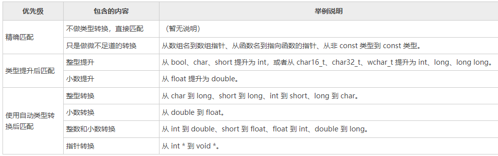

### c++ 函数重载

C++ 允许多个函数拥有**相同的名字**，只要它们的**参数列表不同**就可以，这就是函数的重载（Function Overloading）

`重载就是在一个作用范围内（同一个类、同一个命名空间等）有多个名称相同但参数不同的函数`。重载的结果是`扩展函数适用范围`

`参数列表`又叫参数签名，包括参数的类型、参数的个数和参数的顺序，只要有一个不同就叫做参数列表不同。

> 注意，参数列表不同包括参数的个数不同、类型不同或顺序不同，仅仅参数名称不同是不可以的。函数返回值也不能作为重载的依据。

函数的重载的规则：

-   函数名称必须相同。
-   参数列表必须不同（个数不同、类型不同、参数排列顺序不同等）。
-   函数的返回类型可以相同也可以不相同。
-   仅仅返回类型不同不足以成为函数的重载。

【拓展：c++实现重载原理】

c++编译器根据不同的参数列表，会对重载函数进行重命名，然后根据实参数据类型匹配对应的重命名过后的函数。如果匹配失败则报错，称之为**重载决议**

从这个角度讲，**函数重载仅仅是语法层面的，本质上它们还是不同的函数，占用不同的内存，入口地址也不一样。**

### c++ 函数重载过程的二义性

C++ 标准规定，在进行重载决议时编译器应该按照下面的优先级顺序来处理实参的类型：

编译器应该按照从高到低的顺序来搜索重载函数，首先是精确匹配，然后是类型提升，最后才是类型转换；一旦在某个优先级中找到唯一的一个重载函数就匹配成功，不再继续往下搜索。

如果在一个优先级中找到多个（两个以及以上）合适的重载函数，编译器就会报错——二义性错误。

在匹配重载函数的时候，编译器会根据实参和形参的数据类型对比，对实参进行`类型提升`，仅有此处才有类型提升，其余为类型转换。

> 类型提升是积极的，类型转换确实消极的

### 多个参数时二义性

对于重载的函数，如果参数列表的数据类型过于接近，或者编译器无法判断实参到底匹配哪个形参列表，就会报错
