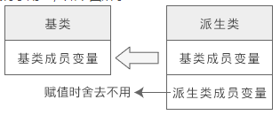

### 向上向下转型

将派生类赋值给基类，派生类对象赋值给基类对象，将派生类指针赋值给基类指针，将派生类引用赋值给基类引用，都算是**向上转型**；反之，则是**向下转型**。

向上转型非常安全，可以由编译器自动完成；向下转型有风险，需要程序员手动干预。

### 派生对象赋值给基类对象

```c++

#include <iostream>
using namespace std;
//基类
class A{
public:
    A(int a);
public:
    void display();
public:
    int m_a;
};
A::A(int a): m_a(a){ }
void A::display(){
    cout<<"Class A: m_a="<<m_a<<endl;
}
//派生类
class B: public A{
public:
    B(int a, int b);
public:
    void display();
public:
    int m_b;
};
B::B(int a, int b): A(a), m_b(b){ }
void B::display(){
    cout<<"Class B: m_a="<<m_a<<", m_b="<<m_b<<endl;
}
int main(){
    A a(10);
    B b(66, 99);
    //赋值前
    a.display();
    b.display();
    cout<<"--------------"<<endl;
    //赋值后
    a = b;
    a.display();
    b.display();
    return 0;
}
```

```
Class A: m_a=10
Class B: m_a=66, m_b=99
=======
Class A: m_a=66
Class B: m_a=66, m_b=99
```

赋值的本质是将现有的数据写入已分配好的内存中，对象的内存只包含了成员变量，所以**对象之间的赋值是成员变量的赋值，成员函数不存在赋值问题。对象之间的赋值不会影响成员函数，也不会影响 this 指针。**

`派生类对象赋值给基类对象时候，会舍弃新增的成员`



这种转换关系是 _不可逆_ 的，_只能用派生类对象给基类对象赋值，而不能用基类对象给派生类对象赋值。_ 理由很简单，基类不包含派生类的成员变量，无法对派生类的成员变量赋值。同理，_同一基类的不同派生类对象之间也不能赋值。_

> 赋值实际上是向内存填充数据，当数据较多时很好处理，舍弃即可，所以不会发生赋值错误。但当数据较少时，问题就很棘手，编译器不知道如何填充剩下的内存，所以会发生错误。

### 将派生类指针赋值给基类指针

```c++
#include <iostream>
using namespace std;
//基类A
class A{
public:
    A(int a);
public:
    void display();
protected:
    int m_a;
};
A::A(int a): m_a(a){ }
void A::display(){
    cout<<"Class A: m_a="<<m_a<<endl;
}
//中间派生类B
class B: public A{
public:
    B(int a, int b);
public:
    void display();
protected:
    int m_b;
};
B::B(int a, int b): A(a), m_b(b){ }
void B::display(){
    cout<<"Class B: m_a="<<m_a<<", m_b="<<m_b<<endl;
}
//基类C
class C{
public:
    C(int c);
public:
    void display();
protected:
    int m_c;
};
C::C(int c): m_c(c){ }
void C::display(){
    cout<<"Class C: m_c="<<m_c<<endl;
}
//最终派生类D
class D: public B, public C{
public:
    D(int a, int b, int c, int d);
public:
    void display();
private:
    int m_d;
};
D::D(int a, int b, int c, int d): B(a, b), C(c), m_d(d){ }
void D::display(){
    cout<<"Class D: m_a="<<m_a<<", m_b="<<m_b<<", m_c="<<m_c<<", m_d="<<m_d<<endl;
}
int main(){
    A *pa = new A(1);
    B *pb = new B(2, 20);
    C *pc = new C(3);
    D *pd = new D(4, 40, 400, 4000);
    pa = pd;
    pa -> display();
    pb = pd;
    pb -> display();
    pc = pd;
    pc -> display();
    cout<<"-----------------------"<<endl;
    cout<<"pa="<<pa<<endl;
    cout<<"pb="<<pb<<endl;
    cout<<"pc="<<pc<<endl;
    cout<<"pd="<<pd<<endl;
    return 0;
}
```

编译器通过指针来访问成员变量，指针指向哪个对象就使用哪个对象的数据；编译器通过指针的类型来访问成员函数，指针属于哪个类的类型就使用哪个类的函数。
