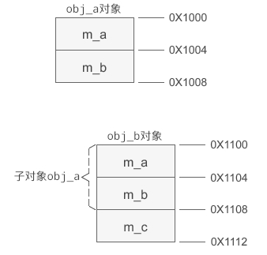

无继承关系的对象内存模型:

- 对象的内存中只包含成员变量，存储在栈区或堆区（使用 new 创建对象）；
- 成员函数与对象内存分离，存储在代码区。

### 继承时的内存模型

有继承关系时，派生类的内存模型可以看成是基类成员变量和新增成员变量的总和，而所有成员函数仍然存储在另外一个区域——代码区，由所有对象共享。

```c++

#include <cstdio>
using namespace std;
//基类A
class A{
public:
    A(int a, int b);
public:
    void display();
protected:
    int m_a;
    int m_b;
};
A::A(int a, int b): m_a(a), m_b(b){}
void A::display(){
    printf("m_a=%d, m_b=%d\n", m_a, m_b);
}
//派生类B
class B: public A{
public:
    B(int a, int b, int c);
    void display();
protected:
    int m_c;
};
B::B(int a, int b, int c): A(a, b), m_c(c){ }
void B::display(){
    printf("m_a=%d, m_b=%d, m_c=%d\n", m_a, m_b, m_c);
}
int main(){
    A obj_a(99, 10);
    B obj_b(84, 23, 95);
    obj_a.display();
    obj_b.display();
    return 0;
}

```



基类的成员变量排在前面，派生类的排在后面。

总结：在派生类的对象模型中，会包含所有基类的成员变量。这种设计方案的优点是访问效率高，能够在派生类对象中直接访问基类变量，无需经过好几层间接计算。
