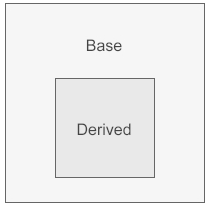
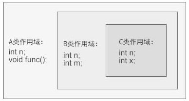

类其实也是一种作用域，每个类都会定义它自己的作用域，在这个作用域内我们再定义类的成员

当*存在继承关系*时，_派生类的作用域嵌套在基类的作用域之内_，_如果一个名字在派生类的作用域内无法找到，编译器会继续到外层的基类作用域中查找该名字的定义。_

作用域能够彼此包含，被包含（或者说被嵌套）的作用域称为**内层作用域**（inner scope），包含着别的作用域的作用域称为**外层作用域**（outer scope）。

在外层作用域中声明（或者定义）了某个名字，那么它所**嵌套着的所有内层作用域中都能访问这个名字。**同时，允许在内层作用域中**重新定义外层作用域中已有的名字。**



```c++
#include<iostream>
using namespace std;
class A{
public:
    void func();
public:
    int n;
};
void A::func(){ cout<<"c.biancheng.net"<<endl; }
class B: public A{
public:
    int n;
    int m;
};
class C: public B{
public:
    int n;
    int x;
};
int main(){
    C obj;
    obj.n;
    obj.func();
    cout<<sizeof(C)<<endl;
    return 0;
}
```



这个过程叫做**名字查找**，也就是在作用域链中寻找与所用名字最匹配的声明（或定义）的过程。

对于成员函数要引起注意，编译器仅仅是根据函数的名字来查找的，不会理会函数的参数。换句话说，**一旦内层作用域有同名的函数，不管有几个，编译器都不会再到外层作用域中查找，编译器仅把内层作用域中的这些同名函数作为一组候选函数；这组候选函数就是一组重载函数。**
