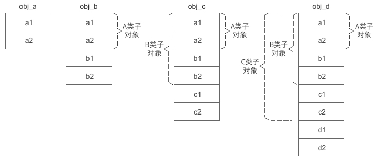
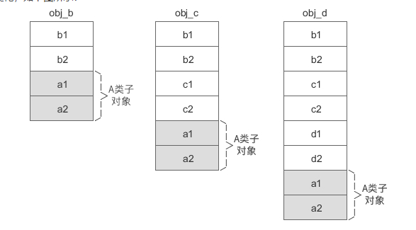
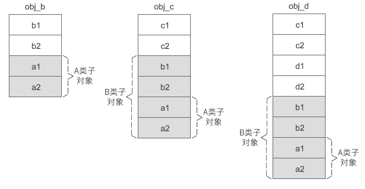

构造函数的执行顺序。虚继承时构造函数的执行顺序与普通继承时不同：在最终派生类的构造函数调用列表中，不管各个构造函数出现的顺序如何，编译器总是先调用虚基类的构造函数，再按照出现的顺序调用其他的构造函数；而对于普通继承，就是按照构造函数出现的顺序依次调用的。

```c++
class A{
protected:
    int m_a1;
    int m_a2;
};
class B: public A{
protected:
    int b1;
    int b2;
};
class C: public B{
protected:
    int c1;
    int c2;
};
class D: public C{
protected:
    int d1;
    int d2;
};
int main(){
    A obj_a;
    B obj_b;
    C obj_c;
    D obj_d;
    return 0;

```

1. 多继承
   
2. A 是 B 的虚基类
   
   虚基类的子对象始终位于派生类对象的最后面
3. A 是 B 的虚基类，B 是 C 的虚基类
   

从上面的两张图中可以发现，虚继承时的派生类对象被分成了两部分：

-   不带阴影的一部分偏移量固定，不会随着继承层次的增加而改变，称为固定部分；
-   带有阴影的一部分是虚基类的子对象，偏移量会随着继承层次的增加而改变，称为共享部分。

当要访问对象的成员变量时，需要知道对象的首地址和变量的偏移，对象的首地址很好获得，关键是变量的偏移。

对于固定部分，偏移是不变的，很好计算；而对于共享部分，偏移会随着继承层次的增加而改变，这就需要设计一种方案，在偏移不断变化的过程中准确地计算偏移。

各个编译器正是在设计这一方案时出现了分歧，不同的编译器设计了不同的方案来计算共享部分的偏移。
