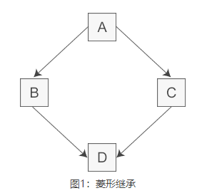
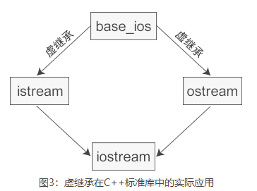

### 多继承缺点

```c++
//间接基类A
class A{
protected:
    int m_a;
};
//直接基类B
class B: public A{
protected:
    int m_b;
};
//直接基类C
class C: public A{
protected:
    int m_c;
};
//派生类D
class D: public B, public C{
public:
    void seta(int a){ m_a = a; }  //命名冲突
    void setb(int b){ m_b = b; }  //正确
    void setc(int c){ m_c = c; }  //正确
    void setd(int d){ m_d = d; }  //正确
private:
    int m_d;
};
```



多继承缺点：

-   命名冲突
-   冗余数据

### 虚继承

虚继承的出现是为了解决 c++支持的多继承出现的弊端：命名冲突和冗余数据

在继承方式前面加上 virtual 关键字就是虚继承，使得在派生类中只保留一份间接基类的成员。

```c++
//间接基类A
class A{
protected:
    int m_a;
};
//直接基类B
class B: virtual public A{  //虚继承
protected:
    int m_b;
};
//直接基类C
class C: virtual public A{  //虚继承
protected:
    int m_c;
};
//派生类D
class D: public B, public C{
public:
    void seta(int a){ m_a = a; }  //正确
    void setb(int b){ m_b = b; }  //正确
    void setc(int c){ m_c = c; }  //正确
    void setd(int d){ m_d = d; }  //正确
private:
    int m_d;
};
```

**虚继承的目的是让某个类做出声明，承诺愿意共享它的基类**。其中，这个被共享的基类就称为**虚基类**，这样在派生类中都只包含一份虚基类的成员。



虚基类只会影响间接派生类，而不会影响直接派生类，在虚派生需求出现之前就要提前完成虚派生的动作。

### 虚基类成员的可见性

能用单一继承解决的问题就不要使用多继承。
