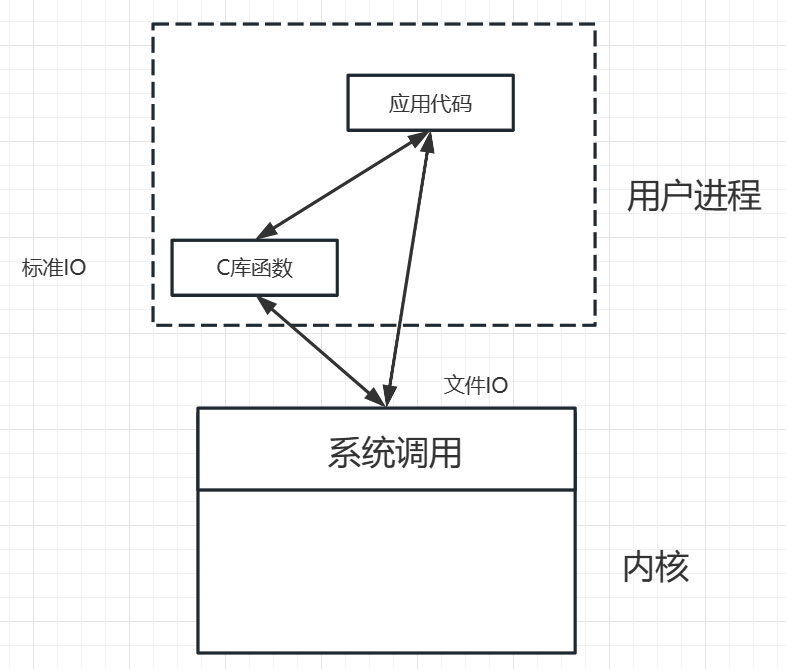
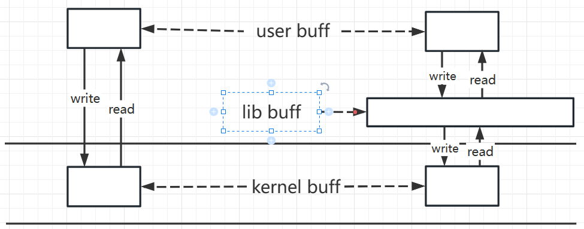

文件 IO：

- open
- close
- read
- write
- lseek

与文件 IO 的区别：

文件 IO：是`直接调用内核提供的系统调用函数`，头文件是`unistd.h`

标准 IO：是`间接调用系统调用函数`，头文件是`stdio.h`

> 标准 IO 底层调用的还是文件 IO

标准 IO 中的相关函数不仅可以读写普通文件，也可以向标准的输入或标准的输出中读或写

### 缓存的概念

1. **用户空间的缓存**

   程序中的缓存，就是你想从内核读写的缓存（数组）

2. **内核空间的缓存**

   每打开一个文件，内核在内核空间中也会开辟一块缓存，这个叫内核空间的缓存

   **文件 IO 的写** 即是将用户空间中的缓存写到内核空间的缓存中
   **文件 IO 的读** 即是将内核空间的缓存写到用户空间的缓存中

3. 标准 IO 的库函数中也有一个缓存，这个缓存称为**库缓存**

   特点：

   - 库缓存遇到\n 时候，即会将库缓存的内容写到内核中，即调用了系统调用函数

     ```c

     #include <stdio.h>
     #include <unistd.h>
     int main(int argc, char* argv[]) {
     char buf[] = "hello linux";
     // printf("%s", buf);// 无法屏幕输出hello linux
     // printf("%s\n", buf);// 屏幕可以输出hello linux
     // write(1, buf, 128);// 屏幕可以输出hello linux
     while (1)
         ;
     return 0;
     }
     ```

   - 库缓存写满时，也会调用系统调用函数，将库缓存内容写入内核缓存

     ```c

        #include <stdio.h>
        #include <unistd.h>
        int main(int argc, char* argv[]) {
        char buf[] = "hello linux";
        int i = 0;
        while (i < 95) {
            printf("%s", buf);//屏幕可以输出hello linux
            i++;
        }
        while (1)
            ;
        return 0;
        }
     ```


