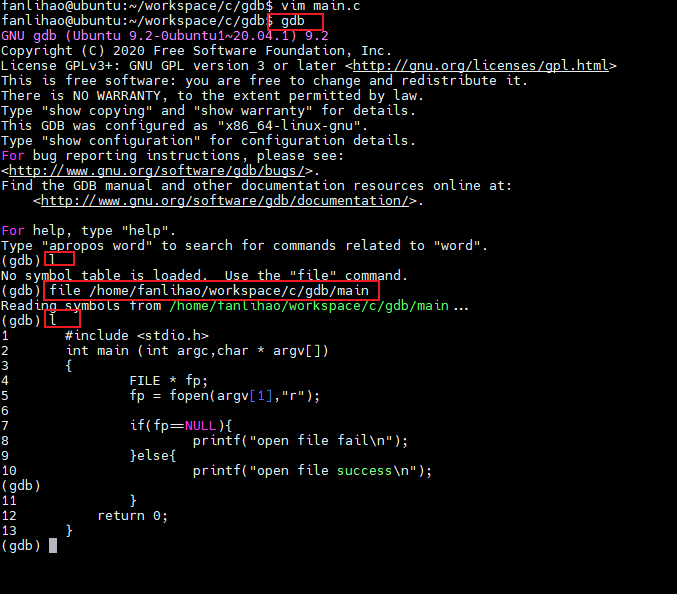

[toc]

### 一、GDB 是什么

程序中的错误分为两类：`语法错误`和`逻辑错误`

- 语法错误编译器可以帮助解决
- 逻辑错误是编译可以通过，但是程序输出结果不符合预期，是代码思路或设计的错误，可以借助调试工具解决

> 通过调试程序，可以监控程序执行的每一个细节，包括变量的值、
> 函数的调用过程、内存中的数据、线程的调度等，从而发现隐藏的错误或低效的代码

**常用的调试工具**

| 调试器名称        | 特点                                                                                                                                                           |
| ----------------- | -------------------------------------------------------------------------------------------------------------------------------------------------------------- |
| `Remote Debugger` | Remote Debugger 是 VC/VS 自带的调试器，与整个 IDE 无缝衔接，使用非常方便。                                                                                     |
| `WinDbg`          | 大名鼎鼎的 Windows 下的调试器，它的功能甚至超越了 Remote Debugger，它还有一个命令行版本（cdb.exe），但是这个命令行版本的调试器指令比较复杂，不建议初学者使用。 |
| `LLDB`            | XCode 自带的调试器，Mac OS X 下开发必备调试器。                                                                                                                |
| `GDB`             | Linux 下使用最多的一款调试器，也有 Windows 的移植版。                                                                                                          |

借助 GDB 调试器可以实现以下几个功能：

- 程序启动时，可以按照我们自定义的要求运行程序，例如设置参数和环境变量；
- 可使被调试程序在指定代码处暂停运行，并查看当前程序的运行状态（例如当前变量的值，函数的执行结果等），即支持断点调试；
- 程序执行过程中，可以改变某个变量的值，还可以改变代码的执行顺序，从而尝试修改程序中出现的逻辑错误。

### 二、GDB 调试 c/c++

**调试前准备**

gcc 编译生成具有调试信息的可执行文件

`gcc -o file file.c -g`

**启动 GDB 调试器**

`gdb a.out`


`gdb a.out -q`


在 gdb 后面输入指令，即可调用 GDB 调试进行对应的调试工作

**常用的调式命令**

| 调试命令                                                | 作用                                                                                   |
| ------------------------------------------------------- | -------------------------------------------------------------------------------------- |
| `(gdb) break line-number`<br/>`(gdb) b line-number`     | 在源代码指定的某一行设置断点                                                           |
| `(gdb) run`<br/>`(gdb) r`                               | 执行被调试的程序，其会自动在第一个断点处暂停执行。                                     |
| `(gdb) continue`<br/>`(gdb) c `                         | 当程序在某一断点处停止运行后，使用该指令可以继续执行，直至遇到下一个断点或者程序结束。 |
| `(gdb) next`<br/>`(gdb) n`                              | 命令代码一行行执行                                                                     |
| `(gdb) print variable-name`<br/>`(gdb) p variable-name` | 打印指定变量的值                                                                       |
| `(gdb) list `<br/>`(gdb) l`                             | 显示源程序代码的内容，包括各行代码所在的行号。                                         |
| `(gdb) quit `<br/>`(gdb) q`                             | 终止调试                                                                               |

**案例**

```c
#include <stdio.h>
int main ()
{
    unsigned long long int n, sum;
    n = 1;
    sum = 0;
    while (n <= 100)
    {
        sum = sum + n;
        n = n + 1;
    }
    return 0;
}
```


### 三、GDB 启动的 4 种方式

1. 直接使用 gdb 指令启动 GDB 调试器

   > 由于事先未指定要调试的具体程序，因此需启动后借助 file 或者 exec-file 命令指定

2. 调试尚未执行的程序

   `gdb program`

   对具有调试信息的可执行文件（-g 选项编译生成的），调用 GDB 调试器的指令格式如上。

3. 调试正在执行的程序

   有时候需要对正在执行的程序进行调试，而又不想重启该程序，可以如下操作：

   - `pidof filename` 事先找到该程序运行所对应的进程号。
   - 调用 GDB 调试正在运行的程序，调用指令有如下三种形式：

     - `gdb attach PID`
     - `gdb 文件名 PID`
     - `gdb -p PID`

     注意，当 GDB 调试器成功连接到指定进程上时，程序执行会暂停。

     调试结束后，想令当前程序进行执行，消除调试操作对它的影响，需手动将 GDB 调试器与程序分离，分离过程分为 2 步：

     - 执行 detach 指令，使 GDB 调试器和程序分离；
     - 执行 quit（或 q）指令，退出 GDB 调试。

4. 调试执行异常崩溃的程序

   > 在 Linux 操作系统中，当程序执行发生异常崩溃时，系统可以将发生崩溃时的内存数据、调用堆栈情况等信息自动记录下载，并存储到一个文件中，该文件通常称为 core 文件，Linux 系统所具备的这种功能又称为核心转储（core dump）。幸运的是，GDB 对 core 文件的分析和调试提供有非常强大的功能支持，当程序发生异常崩溃时，通过 GDB 调试产生的 core 文件，往往可以更快速的解决问题。

### 四、GDB 调试器启动可用参数

xxx

### 五、gdb run(r)命令：启动程序

gdb 提供多种启动程序方式，最常用的是`run`，其次是`start`

二者区别是：

- 默认情况下，run 指令会一直执行程序，直到执行结束。如果程序中存在断点，run 指令则会执行程序至第一个断点处
- start 指令会执行至 main()主函数的起始位置，即在 main()函数的第一行语句处停止执行（该代码尚未执行）

> 程序执行过程中，使用 run 或者 start 指令，表示的是重新启动程序

**GDB 调试器启动后是否就可以直接使用 run 或者 start 指令了呢？答案当然是否定的**

在进行 run 或者 start 命令的时候，会进行一些准备工作，如下：

- 对于尚未指定调试程序的 gdb，需要手动指定
- c/c++文件需要多余的参数
- 程序执行需要临时设置 PATH 环境变量
- 为 gdb 指定工作目录
- GDB 调试器允许对执行程序的输入和输出进行重定向，使其从文件或其它终端接收输入，或者将执行结果输出到文件或其它终端。

```c
#include<stdio.h>
int main(int argc,char* argv[])
{
    FILE * fp;
    if((fp = fopen(argv[1],"r")) == NULL){
        printf("file open fail");
    }
    else{
        printf("file open true");
    }
    return 0;
}
```

**file 指令手动指定调试程序**



**为调试程序传递参数**

1. gdb 启动前，通过 `--args`指定传递参数

   `gdb --args main a.log`

2. gdb 启动时，通过`set args`指定调试程序所需要的参数

3. 使用`run arg1 arg2 ...`或`start arg1 arg2 ...`

**cd 指令修改 gdb 的工作目录**

`cd pathname`

**临时修改 path 环境参数**

`path pathname`

### 六、gdb break(b)命令：设置断点，普通断点

1. **break**

   - `(gdb) break location`

     | location                    | 含义                                                                           |
     | --------------------------- | ------------------------------------------------------------------------------ |
     | `linenum`                   | 表示要打断点处代码的行号                                                       |
     | `filename:linenum`          | 在指令文件 filename 中的第 linenum 行打断点                                    |
     | `+ offset` <br/> `- offset` | 以当前程序暂停位置为准，向后/前 offset 处打断点                                |
     | `function`                  | break 命令会在该函数内部的开头位置打断点，程序会执行到该函数第一行代码处暂停。 |
     | `filename:function`         | 在指定文件 filename 中 function 函数的开头位置打断点。                         |

   - `(gdb) break location if condition`

     含义：每次程序执行到 location 位置时都计算 condition 的值，如果为 True，则程序在该位置暂停；反之，程序继续执行。

2. **tbreak**

   与 break 大多数功能一样，唯一的不同在于，使用 tbreak 命令打的断点仅会作用 1 次，即使程序暂停之后，该断点就会自动消失。

3. **rbreak**

   rbreak 命令的作用对象是 C、C++ 程序中的函数，它会在指定函数的开头位置打断点。

   `(gdb) rbreak regex`

   regex 为一个正则表达式，程序中函数的函数名只要满足 regex 条件，rbreak 命令就会其内部的开头位置打断点。

   rbreak 命令打的断点和 break 命令打断点的效果是一样的，会一直存在，不会自动消失。

### 七、GDB watch 命令：监控变量值的变化，观察断点

GDB 调试器支持在程序中打 3 种断点，分别为**普通断点**、**观察断点**和**捕捉断点**。其中 break 命令打的就是普通断点，而 watch 命令打的为观察断点

借助*观察断点可以监控程序中某个变量或者表达式的值，只要发生改变，程序就会停止执行。*

`(gdb) watch variablesOrexpression`

- `rwatch`：只要程序中出现读取目标变量（表达式）的值的操作，程序就会停止运行；
- `awatch`：只要程序中出现读取目标变量（表达式）的值或者改变值的操作，程序就会停止运行。

【注意】

- 当监控的变量（表达式）为 **局部变量（表达式）** 时，一旦局部变量（表达式）失效，则监控操作也随即失效；
- 如果监控的是一个**指针变量**（例如 *p），则 watch *p 和 watch p 是有区别的，前者监控的是 p 所指数据的变化情况，而后者监控的是 p 指针本身有没有改变指向；
- 可以用于**监控数组中元素值**的变化情况，例如对于 a[10] 这个数组，watch a 表示只要 a 数组中存储的数据发生改变，程序就会停止执行。

### 七、gdb catch 命令：建立捕捉断点

### 八、gdb 添加参数

有三种方法可以指定程序运行的参数，第一种方法是在命令行上直接指定；第二种方法是通过 run 命令提供程序运行时的参数；第三种方法是通过 set args 命令指定程序的参数

1. 第一种方法：为程序传递参数 5

```shell
gdb --args factorial 5
```

2. 第二种方法：为程序传递参数 5

```shell
(gdb) set args 5
(gdb) run
Starting program: /root/debug/factorial 5
warning: no loadable sections found in added symbol-file system-supplied DSO at 0x7ffff7ffa000
Factorial of 5 is 120
```

查看指定给程序的参数通过 show args

```shell
(gdb) show args
Argument list to give program being debugged when it is started is "5".
(gdb)

```

3. 第三种方法：为程序传递参数 5

```shell
(gdb) run 5
```
