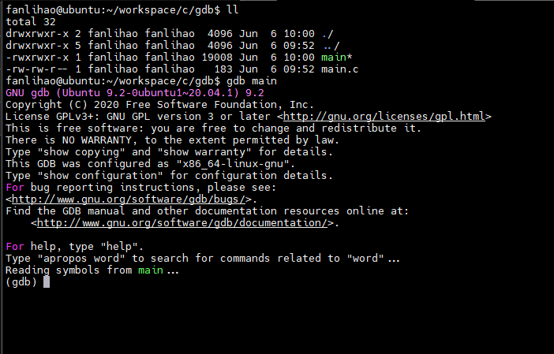
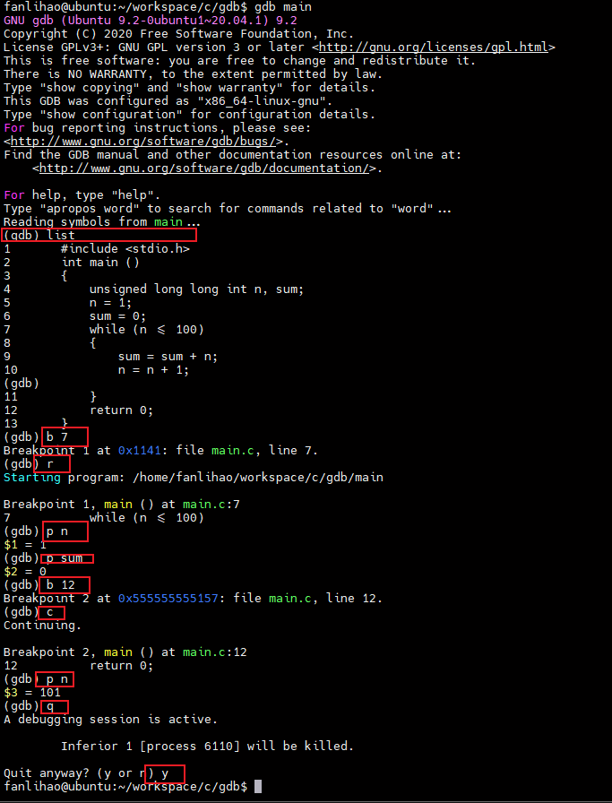

[toc]

### 一、GDB 是什么

程序中的错误分为两类：`语法错误`和`逻辑错误`

-   语法错误编译器可以帮助解决
-   逻辑错误是编译可以通过，但是程序输出结果不符合预期，是代码思路或设计的错误，可以借助调试工具解决

> 通过调试程序，可以监控程序执行的每一个细节，包括变量的值、
> 函数的调用过程、内存中的数据、线程的调度等，从而发现隐藏的错误或低效的代码

**常用的调试工具**

| 调试器名称        | 特点                                                                                                                                                           |
| ----------------- | -------------------------------------------------------------------------------------------------------------------------------------------------------------- |
| `Remote Debugger` | Remote Debugger 是 VC/VS 自带的调试器，与整个 IDE 无缝衔接，使用非常方便。                                                                                     |
| `WinDbg`          | 大名鼎鼎的 Windows 下的调试器，它的功能甚至超越了 Remote Debugger，它还有一个命令行版本（cdb.exe），但是这个命令行版本的调试器指令比较复杂，不建议初学者使用。 |
| `LLDB`            | XCode 自带的调试器，Mac OS X 下开发必备调试器。                                                                                                                |
| `GDB`             | Linux 下使用最多的一款调试器，也有 Windows 的移植版。                                                                                                          |

借助 GDB 调试器可以实现以下几个功能：

-   程序启动时，可以按照我们自定义的要求运行程序，例如设置参数和环境变量；
-   可使被调试程序在指定代码处暂停运行，并查看当前程序的运行状态（例如当前变量的值，函数的执行结果等），即支持断点调试；
-   程序执行过程中，可以改变某个变量的值，还可以改变代码的执行顺序，从而尝试修改程序中出现的逻辑错误。

### 二、GDB 调试 c/c++

**调试前准备**

gcc 编译生成具有调试信息的可执行文件

`gcc -o file file.c -g`

**启动 GDB 调试器**

`gdb a.out`



`gdb a.out -q`


在 gdb 后面输入指令，即可调用 GDB 调试进行对应的调试工作

**常用的调式命令**

| 调试命令                                                | 作用                                                                                   |
| ------------------------------------------------------- | -------------------------------------------------------------------------------------- |
| `(gdb) break line-number`<br/>`(gdb) b line-number`     | 在源代码指定的某一行设置断点                                                           |
| `(gdb) run`<br/>`(gdb) r`                               | 执行被调试的程序，其会自动在第一个断点处暂停执行。                                     |
| `(gdb) continue`<br/>`(gdb) c `                         | 当程序在某一断点处停止运行后，使用该指令可以继续执行，直至遇到下一个断点或者程序结束。 |
| `(gdb) next`<br/>`(gdb) n`                              | 命令代码一行行执行                                                                     |
| `(gdb) print variable-name`<br/>`(gdb) p variable-name` | 打印指定变量的值                                                                       |
| `(gdb) list `<br/>`(gdb) l`                             | 显示源程序代码的内容，包括各行代码所在的行号。                                         |
| `(gdb) quit `<br/>`(gdb) q`                             | 终止调试                                                                               |

**案例**

```c
#include <stdio.h>
int main ()
{
    unsigned long long int n, sum;
    n = 1;
    sum = 0;
    while (n <= 100)
    {
        sum = sum + n;
        n = n + 1;
    }
    return 0;
}
```



### 三、GDB 启动的 4 种方式

1. 直接使用 gdb 指令启动 GDB 调试器

    > 由于事先未指定要调试的具体程序，因此需启动后借助 file 或者 exec-file 命令指定

2. 调试尚未执行的程序

    `gdb program`

    对具有调试信息的可执行文件（-g 选项编译生成的），调用 GDB 调试器的指令格式如上。

3. 调试正在执行的程序

    有时候需要对正在执行的程序进行调试，而又不想重启该程序，可以如下操作：

    - `pidof filename` 事先找到该程序运行所对应的进程号。
    - 调用 GDB 调试正在运行的程序，调用指令有如下三种形式：

        - `gdb attach PID`
        - `gdb 文件名 PID`
        - `gdb -p PID`

        注意，当 GDB 调试器成功连接到指定进程上时，程序执行会暂停。

        调试结束后，想令当前程序进行执行，消除调试操作对它的影响，需手动将 GDB 调试器与程序分离，分离过程分为 2 步：

        - 执行 detach 指令，使 GDB 调试器和程序分离；
        - 执行 quit（或 q）指令，退出 GDB 调试。

4. 调试执行异常崩溃的程序

    > 在 Linux 操作系统中，当程序执行发生异常崩溃时，系统可以将发生崩溃时的内存数据、调用堆栈情况等信息自动记录下载，并存储到一个文件中，该文件通常称为 core 文件，Linux 系统所具备的这种功能又称为核心转储（core dump）。幸运的是，GDB 对 core 文件的分析和调试提供有非常强大的功能支持，当程序发生异常崩溃时，通过 GDB 调试产生的 core 文件，往往可以更快速的解决问题。


### 四、GDB调试器启动可用参数

xxx