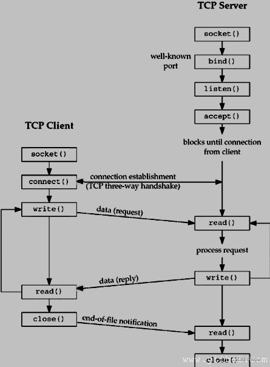

#### TCP/UDP 区别

1. TCP 面向连接（打电话需要先拨号建立连接）；UDP 是面向报文的，即发送数据之前，是不需要建立连接的
2. TCP 提供可靠服务。TCP 发送的数据无差错，不丢失，不重复，且按序到达；UDP 尽最大努力交付，即不保证可靠交付
3. TCP 面向字节流，数据被看作一连串无结构的字节流；UDP 是面向报文的的，UDP 没有拥塞控制，因此网络出现拥塞不会使源主机的发送速率降低（实时应用，ip 电话，视频）
4. 每一条 TCP 只能是点对点；UDP 支持一对一，一对多，多对一，多对多的交互通信
5. TCP 首部开销 20 字节；UDP 首部开销小，8 字节
6. TCP 的逻辑通信信道是全双工的可靠信道，UDP 则是不可靠信道

#### 端口号作用

一台 ip 服务器，提供多个"服务"

通过 ip+port 的方式可以找到服务器上的特定服务

#### 字节序

多字节数据在计算机内存中存储或者网络传输时，各字节存储顺序

**常见顺序**

1. 小端字节序：将低序字节存储在起始地址
2. 大端字节序：将高序字节存储在起始地址（网络字节序）

扩展

**字长（字）**
字长：同一时间处理二进制位数
字长通常为 16、32、64 位，与计算机位数相同

**字节**
1 字节 = 8 位二进制
1 字节分配一个存储地址

**双字**
1 字 = 2 字节 = 16 位
1 双字 = 2 字 = 4 字节 = 32 位
2 双字 = 4 字 = 8 字节 = 64 位

LinuxC 64 位操作系统

| 类型             | 字节 | 位  |
| ---------------- | ---- | --- |
| char             | 1    | 8   |
| short            | 2    | 16  |
| int              | 4    | 32  |
| unsigned int     | 4    | 32  |
| long（long int） | 8    | 64  |
| long long        | 8    | 64  |
| float            | 4    | 32  |
| double           | 8    | 64  |
| 指针             | 8    | 64  |

#### socket 编程步骤



1. 创建套接字

2. 为套接字添加信息（ip+port）

3. 监听网络连接

4. 监听到有客户端接入，接收一个连接

5. 数据交互

6. 关闭套接字，断开连接

<a href="https://blog.csdn.net/qzcsu/article/details/72861891">TCP 的三次握手与四次挥手</a>
<a href="https://blog.csdn.net/qq_73471456/article/details/130049354?utm_medium=distribute.pc_relevant.none-task-blog-2~default~baidujs_baidulandingword~default-0-130049354-blog-121423549.235^v38^pc_relevant_anti_vip_base&spm=1001.2101.3001.4242.1&utm_relevant_index=3">TCP 的三次握手与四次挥手</a>

#### linux 网络编程 API

##### 一）服务端

**1.创建空白套接字：socket()**

```c
#include <sys/types.h>
#include <sys/socket.h>

int socket(int domain, int type, int protocol);

// 成功返回套接字描述符，否则返回-1，并设置errno
```

**参数**

1. domain：指定协议族，协议族`决定了 socket 的地址类型`，在通信中必须采用对应的地址。常见的有：
   - `AF_INET`(常用)
   - `AF_INET6`
   - `AF_LOCAL（或称AF_UNIX，Unix域socket）`
   - `AF_ROUTE`
2. type：指定 socket 类型，常见的有：
   - `SOCK_STREAM`字节流，流式套接字提供可靠的、面向连接的通信流；它使用 TCP 协议，从而保证了数据传输的正确性和顺序性。
   - `SOCK_DGRAM`数据报，数据报套接字定义了一种无连接的服务器，数据通过相互独立的报文进行传输，是无序的，并且不能保证是可靠、无差错的。使用 UDP 协议
   - `SOCK_RAW`原始套接口，允许程序使用低层协议，原始套接字允许对底层协议如 IP 或 ICMP 进行访问，功能强大但较为不便，主要用于一些协议的开发。
   - `SOCK_SEQPACKET`有序分组
     > 不是每一种协议簇都支持这里的所有的类型，所以类型与协议簇要匹配。
3. protocol：指定协议，常见的有：
   - `0` 0 选择 type 类型对应的默认协议
   - `IPPROTO_TCP` TCP 传输协议
   - `IPPROTO_UDP` UDP 传输协议
   - `IPPROTO_SCTP` STCP 传输协议
   - `IPPROTO_TIPC` TIPC 传输协议

**代码案例**

```c
// 创建TCP套接字
int tcp_socket = socket(AF_INET, SOCK_STREAM, 0);
// 创建UDP套接字
int udp_socket = socket(AF_INET, SOCK_DGRAM, 0);
```

**2.为套接字添加信息 ip+port：bind()**

```c
#include <sys/types.h>
#include <sys/socket.h>

int bind(int sockfd, const struct sockaddr *addr, socklen_t addrlen);
// 成功返回0，否则返回-1


// 对于不同的socket domain定义了一个通用的数据结构。
struct sockaddr {
  //协议族
  unsigned short int sa_family;
  char sa_data[14];
};

// 协议族为AF_INET的addr
struct sockaddr_in {
  sa_family_t sin_family;  /* address family: AF_INET */
  in_port_t sin_port;      /* port in network byte order */
  struct in_addr sin_addr; /* internet address */
};
struct in_addr {
  uint32_t s_addr; /* address in network byte order */
};

// 协议族为AF_UNIX的addr
struct sockaddr_un {
  sa_family_t sun_family; /* AF_UNIX */
  char sun_path[108];     /* Pathname */
};
```

bind()用来设置给参数 sockfd 的 socket 一个名称。此名称由参数 addr 指向一 sockaddr 结构，对于不同的 socket domain 定义了一个通用的数据结构。

**参数**

1. sockfd：socket 描述符
2. addr：是一个指向含有本机 ip+port 等信息的 sockaddr 类型的指针，指向要绑定 sockfd 的协议结构地址，这个地址根据创建 socket 时的地址协议族的不同而不同
3. addrlen：对应的是地址的长度

**代码案例**

```c
// 2. 为套接字添加信息（ip+port）
struct sockaddr_in tcp_info;
tcp_info.sin_family = AF_INET;
tcp_info.sin_port = atoi(argv[2]);
inet_aton(argv[1], &tcp_info.sin_addr);

int bind_ret = bind(tcp_socket, (struct sockaddr *)&tcp_info,
                    sizeof(struct sockaddr_in));
```

**3.地址转换 API**

```c
//字符串形式"192.168.……"转为网络能识别的格式
int inet_aton(const char* straddr, struct in_addr *addrp);

//把网络格式的ip地址转为字符串形式
char* inet_ntoa(struct in_addr inaddr);
```

**4.监听网络连接：listen()**

```c
#include <sys/socket.h>
#include <sys/types.h>
// 等待参数socket的套接字连线
int listen(int sockfd, int backlog);
// 成功返回0，否则返回-1
```

**参数**

1. sockfd： socket 的描述符
2. backlog： 指定同时能处理的最大连接要求，如果连接数目达此上限则 client 端将收到 ECONNREFUSED 的错误。

Listen()并未开始接收连线，**只是设置 socket 为 listen 模式**，真正接收 client 端连线的是 accept()。通常 listen()会在 socket()，bind()之后调用，接着才调用 accept()。

2 个功能：

- 将一个未连接的套接字转换为一个被动套接字（监听）②
- 规定内核为相应套接字排队的最大连接数。

内核为任何一个给定监听套接字维护两个队列：①

- `未完成连接队列`，每个这样的 SYN 报文段对应其中一项：已由某个客户端发出并到达服务器，而服务器正在努力等待完成相应的 TCP 三次握手过程。这些套接字处于 SYN_REVD 状态。②
- `已完成连接队列`，每个已完成 TCP 三次握手过程的客户端对应其中一项。这些套接字处于 ESTABLISHED 状态。

**代码案例**

```c
// 3. 设置套接字监听模式
int listen_ret = listen(tcp_socket, 8);
if (listen_ret != 0) {
printf("listen error\n");
exit(-1);
}
```

**5.接受网络连接：accept()**

```c
#include <sys/socket.h>
#include <sys/types.h>

int accept(int sockfd, struct sockaddr *addr, socklen_t *addrlen);
// 成功则返回新的socket，失败返回-1，错误原因存在于errno中
```

accept 函数由 TCP 服务器调用，用于`从已完成连接队列头返回下一个已完成连接`。如果已完成连接队列为空，那么进程被投入睡眠。

**参数**

1. sockfd： 是 socket 系统调用返回的服务器端 socket 描述符
2. addr： 用来返回已连接的对端（客户端）的协议地址
3. addrlen：客户端地址长度

该函数的返回值是一个`新的套接字描述符`，返回值是表示`已连接的套接字描述符`，而第一个参数是服务器监听套接字描述符。

一个服务器通常仅仅创建一个`监听套接字`，它在该服务器的生命周期内一直存在。

内核为每个由服务器进程接受的客户连接创建一个已连接套接字（表示 TCP 三次握手已完成），当服务器完成对某个给定客户的服务时，相应的已连接套接字就会被关闭。

**代码案例**

```c
struct sockaddr_in client_info;
int client_socket = accept(tcp_socket, (struct sockaddr *)&client_info,
                            sizeof(struct sockaddr_in));

printf("client's ip is %s\n", inet_ntoa(client_info.sin_addr));
printf("client's port is %d\n", client_info.sin_port);
```

**6.数据收发 API**

```c
// TCP数据收发常用第一套API
ssize_t write(int fd, const void *buf, size_t count);
ssize_t read(int fd, void *buf, size_t count);

// TCP数据收发常用第二套API：有连接
ssize_t send(int sockfd, const void *buf, size_t len, int flags);
ssize_t recv(int sockfd, void *buf, size_t len, int flags);

//返回值：返回读或写的字节个数，出错返回-1
```

> recv()/send(), readv()/writev(), recvmsg()/sendmsg(), recvfrom()/sendto()等

##### 二）客户端

**1.客服端连接：connect()**

```c
#include <sys/socket.h>
#include <sys/types.h>

int connect(int sockfd, const struct sockaddr *addr, socklen_t addrlen);
```

**参数**

- sockfd：客户端的 socket 描述符
- addr：客户端服务器的 IP 地址和端口号，一个结构体
- addrlen： 是第二个参数，结构体指针的大小，一般用 sizeof()就可以搞定

**2.数据收发**

```c
// TCP数据收发常用第一套API
ssize_t write(int fd, const void *buf, size_t count);
ssize_t read(int fd, void *buf, size_t count);

// TCP数据收发常用第二套API：有连接
ssize_t send(int sockfd, const void *buf, size_t len, int flags);
ssize_t recv(int sockfd, void *buf, size_t len, int flags);
```

**代码案例一**

```c

//client.c

#include <arpa/inet.h>
#include <netinet/in.h>
#include <netinet/ip.h>
#include <stdio.h>
#include <stdlib.h>
#include <string.h>
#include <sys/socket.h>
#include <sys/types.h>
#include <unistd.h>
int main(int argc, char **argv) {
  // 连接套接字
  int client_sockfd;
  // 连接套接字信息
  struct sockaddr_in client_info;
  char readBuf[128] = {0};
  char *msg = "this is message from client";
  // filename ip port
  //   if (argc != 3) {
  //     printf("don't have enough params\n");
  //     exit(-1);
  //   }

  memset(&client_info, 0, sizeof(struct sockaddr_in));

  // 1. 创建套接字
  client_sockfd = socket(AF_INET, SOCK_STREAM, 0);
  if (client_sockfd == -1) {
    printf("create socket error\n");
    perror("error");
  }

  // 2.  connect
  client_info.sin_family = AF_INET;
  //   client_info.sin_port = atoi(argv[2]);
  //   inet_aton(argv[1], &client_info.sin_addr);
  client_info.sin_port = atoi("8081");
  inet_aton("172.28.59.38", &client_info.sin_addr);

  if (connect(client_sockfd, (struct sockaddr *)&client_info,
              sizeof(struct sockaddr)) == -1) {
    perror("connect");
    exit(-1);
  }

  // 5. 数据收发
  // write
  int n_write = write(client_sockfd, msg, strlen(msg));
  if (n_write == -1) {
    perror("write");
  } else {
    printf("write successfully\n");
  }

  //   read
  int n_read = read(client_sockfd, readBuf, 128);
  if (n_read == -1) {
    perror("read");
  } else {
    printf("read successfully\n");
    printf("this is from client:%s\n", readBuf);
  }

  // 6. 关闭套接字
  close(client_sockfd);
  return 0;
}

//server.c
#include <arpa/inet.h>
#include <netinet/in.h>
#include <netinet/ip.h>
#include <stdio.h>
#include <stdlib.h>
#include <string.h>
#include <sys/socket.h>
#include <sys/types.h>
#include <unistd.h>

void logg(char *name, char *msg, int level) {
  switch (level) {
    case 0:
      printf("%s logg message => %s\n", name, msg);
      break;
    default:
      break;
  }
}

int main(int argc, char **argv) {
  // 监听套接字
  int tcp_sockfd;
  // 监听套接字信息
  struct sockaddr_in tcp_info;
  // 连接套接字
  int client_sockfd;
  // 连接套接字信息
  struct sockaddr_in client_info;

  char readBuf[128] = {0};
  char *msg = "this is message from server";
  // filename ip port
  //   if (argc != 3) {
  //     printf("don't have enough params\n");
  //     exit(-1);
  //   } else {
  //     printf("argv[0] = %s\n", argv[0]);
  //     printf("argv[1] = %s\n", argv[1]);
  //     printf("argv[2] = %s\n", argv[2]);
  //   }
  memset(&tcp_info, 0, sizeof(struct sockaddr_in));
  memset(&client_info, 0, sizeof(struct sockaddr_in));

  // 1. 创建套接字
  tcp_sockfd = socket(AF_INET, SOCK_STREAM, 0);
  if (tcp_sockfd == -1) {
    logg("server", "create socket error", 0);
    perror("error");
  } else {
    logg("server", "create socket  successfully", 0);
  }

  // 2. 为监听套接字添加信息（ip+port）
  tcp_info.sin_family = AF_INET;
  //   tcp_info.sin_port = atoi(argv[2]);
  //   inet_aton(argv[1], &tcp_info.sin_addr);
  inet_aton("172.28.59.38", &tcp_info.sin_addr);
  tcp_info.sin_port = atoi("8081");
  logg("server", "server listen ip 172.28.59.38", 0);
  logg("server", "server listen port 8081", 0);
  int bind_ret =
      bind(tcp_sockfd, (struct sockaddr *)&tcp_info, sizeof(struct sockaddr));
  if (bind_ret != 0) {
    printf("bind error\n");
    exit(-1);
  } else {
    printf("bind successfully\n");
  }

  // 3. 设置套接字监听模式
  int listen_ret = listen(tcp_sockfd, 8);
  if (listen_ret != 0) {
    printf("listen error\n");
    exit(-1);
  } else {
    printf("listen successfully\n");
  }

  //   int mark = 0;
  //   while (1) {}

  // 4. 监听到有客户端接入，接收一个连接
  socklen_t len = sizeof(struct sockaddr);
  client_sockfd =
      accept(tcp_sockfd, (struct sockaddr *)&client_info, (socklen_t *)&len);
  if (client_sockfd == -1) {
    perror("accept");
    exit(-1);
  } else {
    printf("accept successfully\n");
    printf("some client connected\n");
  }

  // 5. 数据收发
  // read
  int n_read = read(client_sockfd, readBuf, 128);
  if (n_read == -1) {
    perror("read");
  } else {
    printf("read successfully\n");
    printf("this is msg from client:%s\n", readBuf);
  }

  //   write
  int n_write = write(client_sockfd, msg, strlen(msg));
  if (n_write == -1) {
    perror("write");
  } else {
    printf("write successfully\n");
  }

  // 6. 关闭套接字
  close(tcp_sockfd);
  return 0;
}


```
