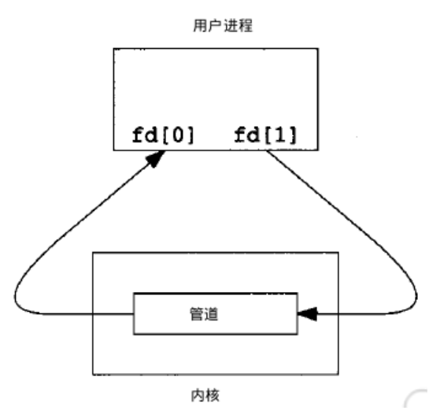
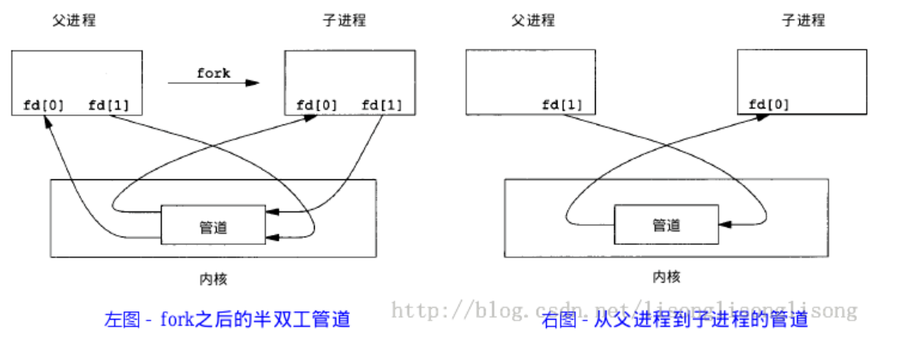

#### 进程通信 IPC 介绍

进程通信（IPC）是指不同进程之间传播或交换信息

**IPC 的方式通常有管道（无名管道和命名管道）、消息队列、信号量、共享存储、socket、streams 等，其中 socket 和 streams 支持不同进程主机上的两个进程 IPC**

#### 一、管道

管道，通常指无名管道，UNIX 系统 IPC 最古老的形式

##### **特点**

1. 半双工的（数据只能从一个方向上流动），具有固定的读端和写端，**同一时间数据是单向的**，另外，管道不存储数据，读走就没了（类似水管）
2. 只能用于**具有亲缘关系**的进程之间的通信（父子进程或兄弟进程）
3. 可以看作是一种特殊的文件，对于他的`读写可以用普通的 read、write 等函数`，但他不是普通文件，不属于其他的文件系统，并且`只存在于内存`
   > 父子进程退出后，管道就不存在了

---

管道是只存在内存中，用于联系父子或兄弟关系的进程的，只有两个口，一个读口，一个写口；

父子通信数据流向：

- 父->子：父 关读开写，子反之
- 子->父：父 开读关写，子反之

---

##### **原型**

```c
#include <unistd.h>
int pipe(int fd[2]);
// 返回值：若成功返回0，失败返回-1
```

当一个管道建立时，它会创建两个文件描述符：`fd[0]为读而打开，fd[1]为写而打开，要关闭管道只需将这两个文件描述符关闭即可`

**01 读写**



##### **例子**

单个进程的管道几乎作用不大。

`通常调用pipe的进程接着调用fork，这就可以创建父子进程之间的IPC通道`



```c
// 无名管道：数据从父进程流向子进程
// 无名管道只能实现单向通信，若要采用无名管道进行父子进程通信，建议建立两个无名管道
#include <stdio.h>
#include <stdlib.h>
#include <string.h>
#include <sys/types.h>
#include <sys/wait.h>
#include <unistd.h>

int main() {
  int fd[2];

  char readBuf[128];
  // 子进程pid
  pid_t pid;

  if (pipe(fd) == -1) {
    printf("create pipe unsuccessfully\n");
  }

  // 父进程返回新建子进程ID
  // 子进程返回0
  pid = fork();
  if (pid > 0) {
    // 父进程休眠3s，让子进程等待
    sleep(3);
    printf("this is father\n");
    close(fd[0]);
    write(fd[1], "hello from father", strlen("hello from father"));
    wait(NULL);
  } else if (pid == 0) {
    printf("this is children\n");
    close(fd[1]);
    read(fd[0], readBuf, 128);
    printf("read from father : %s\n", readBuf);
    exit(1);
  } else {
    printf("create children process unsuccessfully\n");
  }
}

```

#### 二、FIFO

FIFO，也称命名管道，是一种`文件类型`

##### **特点**

1. FIFO 可以`在没有关系的进程之间交换数据，与无名管道不同`
2. FIFO 有路径名与之相关联，以一种特殊设备文件形式**储存**在于文件系统中(写入 FIFO 文件的内容会被保存下来)

##### **原型**

```c
#include <sys/stat.h>
int mkfifo(const char *pathname, mode_t mode);
// 返回值：成功返回0，出错返回-1
```

mode 参数 与 open 函数的 mode 一致。创建一个管道文件，就可以用一般的文件 IO 函数操作他

当 open 函数操作一个 FIFO 时候，是否设置 O_NONBLOCK 区别：

- `默认不指定`。
  只读 open 要阻塞到某个其他进程为写而打开此 FIFO。
  只写 open 要阻塞到某个其他进程为读而打开它。
- 指定。
  则只读 open 立即返回。
  而只写 open 将出错返回 -1 如果没有进程已经为读而打开该 FIFO，其 errno 置 ENXIO。

##### **案例**

```c
// 创建FIFO，然后read只读阻塞等待别的进程写入
#include <errno.h>
#include <fcntl.h>
#include <stdio.h>
#include <stdlib.h>
#include <sys/stat.h>
#include <sys/types.h>
#include <unistd.h>
int main(int argc, char** argv) {
  char readBuf[128] = {0};
  const char* pathname = "./fifotest1";

  if (mkfifo(pathname, 0600) == -1 && errno != EEXIST) {
    printf("create fifo failed\n");
    perror("error -> ");
  }

  int fd = open(pathname, O_RDONLY);
  int nread = 0;
  if (fd == -1) {
    printf("open fifo file unsuccessfully\n");
    perror("error -> ");
  } else {
    printf("open fifo file success\n");
    while (1) {
      nread = read(fd, readBuf, 64);
      sleep(1);
      printf("read %d bytes,context is %s\n", nread, readBuf);
    }
    close(fd);
  }

  return 0;
}

// 向已有的FIFO 只写 输入内容其中
#include <fcntl.h>
#include <stdio.h>
#include <stdlib.h>
#include <string.h>
#include <sys/stat.h>
#include <sys/types.h>
#include <unistd.h>

int main(int argc, char** argv) {
  const char* pathname = "./fifotest1";

  char writeBuf[] = "hello world from 07.c";
  int fd = open(pathname, O_WRONLY);

  int cnt = 0;

  if (fd == -1) {
    printf("write file failed\n");
    perror("error ->");
  } else {
    while (1) {
      if (cnt == 5) {
        break;
      }
      write(fd, writeBuf, strlen(writeBuf));
      sleep(1);
      cnt++;
    }

    close(fd);
  }

  return 0;
}
```

#### 三、消息队列

消息队列，是消息的链接表，存放在内核中。

一个消息队列由一个标识符（队列 ID）来标识

##### **特点**

1. 消息队列是**面向记录**的，其中的消息**具有特定的格式以及特定的优先级**。

2. 消息队列**独立**于发送与接收进程。进程终止时，消息队列及其内容并不会被删除。

3. 消息队列可以实现消息的**随机查询**,消息不一定要以先进先出的次序读取,也可以按消息的类型读取。

##### **原型**

```c
1 #include <sys/msg.h>
2 // 创建或打开消息队列：成功返回队列ID，失败返回-1
3 int msgget(key_t key, int flag);
4 // 将新信息添加到指定队列（msgid）的队尾：成功返回0，失败返回-1
5 int msgsnd(int msqid, const void *ptr, size_t size, int flag);
6 // 读取消息，先进先出或者消息类型 取消息：成功返回消息数据的长度，失败返回-1
7 int msgrcv(int msqid, void *ptr, size_t size, long type,int flag);
8 // 控制消息队列：成功返回0，失败返回-1
9 int msgctl(int msqid, int cmd, struct msqid_ds *buf);
```

在以下两种情况下，**msgget** 将**创建**一个新的消息队列：

- 如果没有与键值 key 相对应的消息队列，并且 flag 中包含了`IPC_CREAT` 标志位。
- key 参数为 `IPC_PRIVATE`。

函数 **msgrcv** 在**读取消息队列**时，type 参数有下面几种情况：

| type | 取消息方式                                                                         |
| ---- | ---------------------------------------------------------------------------------- |
| =0   | 先进先出的方式，取消息                                                             |
| >0   | 取具有特定类型 type 的消息（返回队列中消息类型为 type 的第一个消息）               |
| <0   | 取消息队列中消息类型小于或等于 type 绝对值的消息，如果有多个，则取类型值最小的消息 |

**type 值非 0 时用于以非先进先出次序读消息。也可以把 type 看做优先级的权值。**

##### **ftok 生成消息队列标识 ID**

https://blog.csdn.net/u013485792/article/details/50764224

##### **msgctl 控制消息队列**

msgctl 函数是一个用于控制消息队列的系统调用函数，在 Unix/Linux 系统中使用。其函数原型如下：

```c
#include <sys/types.h>
#include <sys/ipc.h>
#include <sys/msg.h>

int msgctl(int msqid, int cmd, struct msqid_ds *buf);
//返回值为操作成功时返回 0，否则返回-1。
```

函数参数说明如下：

- `msqid`：消息队列的标识符，由 msgget 函数返回。
- `cmd`：命令参数，用于指定 msgctl 函数的操作类型，可以是 IPC_STAT、IPC_SET、IPC_RMID 等。
- `buf`：用于传递消息队列的状态信息，是一个指向 msqid_ds 结构体类型的指针。

msqid_ds 结构体类型定义如下：

```c
struct msqid_ds {
    struct ipc_perm msg_perm;    /* Ownership and permissions */
    time_t msg_stime;            /* Time of last msgsnd(2) */
    time_t msg_rtime;            /* Time of last msgrcv(2) */
    time_t msg_ctime;            /* Time of last change */
    unsigned long msg_cbytes;    /* Current number of bytes in queue */
    msgqnum_t msg_qnum;          /* Current number of messages in queue */
    msglen_t msg_qbytes;         /* Maximum number of bytes allowed in queue */
    pid_t msg_lspid;             /* PID of last msgsnd(2) */
    pid_t msg_lrpid;             /* PID of last msgrcv(2) */
};
```

msgctl 函数的命令参数`cmd`的取值如下：

- IPC_STAT：获取消息队列的状态信息，将消息队列的状态信息保存到`buf`指向的结构体中。
- IPC_SET：设置消息队列的状态信息，将`buf`指向的结构体中的状态信息更新到消息队列中。
- IPC_RMID：删除消息队列。

使用示例：

```c
#include <stdio.h>
#include <stdlib.h>
#include <sys/types.h>
#include <sys/ipc.h>
#include <sys/msg.h>

int main()
{
    int msgid;
    key_t key;
    struct msqid_ds info;

    // 创建消息队列
    key = ftok(".", 'a');
    msgid = msgget(key, IPC_CREAT|0666);
    if (msgid == -1) {
        perror("msgget error");
        exit(1);
    }

    // 获取消息队列状态信息
    if (msgctl(msgid, IPC_STAT, &info) == -1) {
        perror("msgctl error");
        exit(1);
    }

    printf("Message queue size: %ld\n", info.msg_qbytes);

    // 删除消息队列
    if (msgctl(msgid, IPC_RMID, NULL) == -1) {
        perror("msgctl error");
        exit(1);
    }

    return 0;
}
```

上面的示例中，首先使用`ftok`函数创建一个 IPC 键值，然后使用`msgget`函数创建一个消息队列并返回该队列的标识符。接着，调用`msgctl`函数获取消息队列的状态信息，并打印出消息队列的大小。最后，调用`msgctl`函数删除消息队列。

##### **消息队列进程通信案例**

```c
// get.c
#include <stdio.h>
#include <stdlib.h>
#include <string.h>
#include <sys/ipc.h>
#include <sys/msg.h>
#include <sys/types.h>
// int msgget(key_t key, int msgflg);

struct msgBuf {
  long mtype;
  char mnext[128];
};

int main(int argc, char **argv) {
  struct msgBuf readBuf;
  struct msgBuf sendBuf = {996, "this is message from getter"};
  // 该函数用于生成唯一ID key
  key_t key;
  key = ftok(".", 12);

  int mqID = msgget(key, IPC_CREAT | 0777);

  if (mqID == -1) {
    printf("get message queue failed\n");
    exit(1);
  }

  // 阻塞的形式等待队列mqID中类型为888的消息
  int retGet = msgrcv(mqID, &readBuf, sizeof(readBuf.mnext), 888, 0);
  if (retGet != -1) {
    printf("getter receive message: %s\n", readBuf.mnext);
  } else {
    printf("getter receive message unsuccessfully\n");
  }

  int retSend = msgsnd(mqID, &sendBuf, strlen(sendBuf.mnext), 0);
  if (retSend != -1) {
    printf("getter send message successfully\n");
  } else {
    printf("getter send message unsuccessfully\n");
  }

  // 删除消息队列
  if (msgctl(msgid, IPC_RMID, NULL) == -1) {
    perror("msgctl error");
    exit(1);
  }
  return 0;
}


//send.c
#include <stdio.h>
#include <stdlib.h>
#include <string.h>
#include <sys/ipc.h>
#include <sys/msg.h>
#include <sys/types.h>

struct msgBuf {
  long mtype;
  char mnext[128];
};

int main(int argc, char **argv) {
  struct msgBuf sendBuf = {888, "this is message from sender"};
  struct msgBuf readBuf;

  key_t key;
  // 该函数用于生成唯一ID key
  key = ftok(".", 12);
  int mqID = msgget(key, IPC_CREAT | 0777);

  if (mqID == -1) {
    printf("get message queue failed\n");
    exit(1);
  }

  // 非阻塞的方式发送
  int retSend = msgsnd(mqID, &sendBuf, strlen(sendBuf.mnext), 0);
  if (retSend != -1) {
    printf("send message successfully\n");
  } else {
    printf("send message unsuccessfully\n");
  }
  // 阻塞方式等待getter发送反馈消息
  int retGet = msgrcv(mqID, &readBuf, sizeof(readBuf.mnext), 996, 0);

  if (retGet != -1) {
    printf("sender receive message successfully\n");
    printf("sender receive message: %s\n", readBuf.mnext);
  } else {
    printf("sender receive message unsuccessfully\n");
  }

    // 删除消息队列
  if (msgctl(msgid, IPC_RMID, NULL) == -1) {
    perror("msgctl error");
    exit(1);
  }
  return 0;
}

// 在内核中产生，修改队列
```
