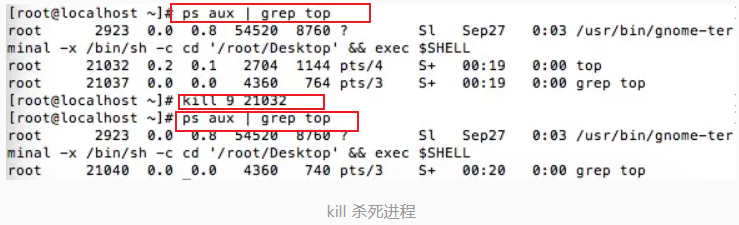
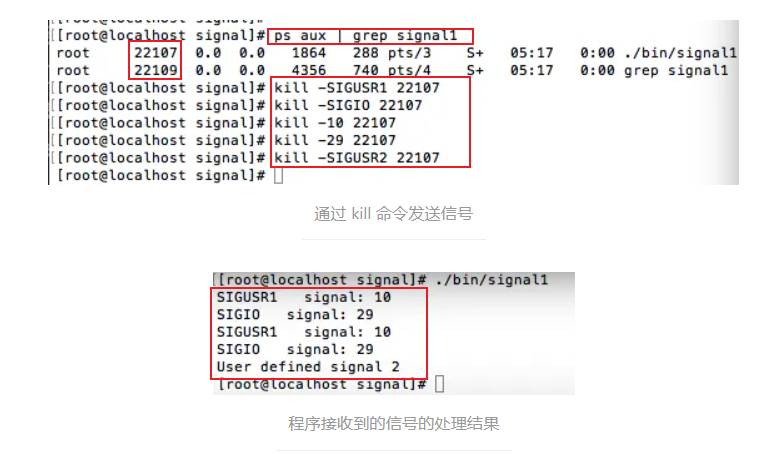

#### 四、共享内存

##### 原型

```c
1 #include <sys/shm.h>
2 // 创建或获取一个共享内存：成功返回共享内存ID，失败返回-1
3 int shmget(key_t key, size_t size, int flag);
4 // 连接共享内存到当前进程的地址空间：成功返回指向共享内存的指针，失败返回-1
5 void *shmat(int shm_id, const void *addr, int flag);
6 // 断开与共享内存的连接：成功返回0，失败返回-1
7 int shmdt(void *addr);
8 // 控制共享内存的相关信息：成功返回0，失败返回-1
9 int shmctl(int shm_id, int cmd, struct shmid_ds *buf);
```

使用步骤：

1. 创建共享/打开内存 —— shmget
2. 映射 —— shmat
3. 发送接收数据 ——
4. 释放共享内存 —— shmdt
5. 干掉进程 —— shmctl

**参数**

| 函数   | 作用                                 | 参数                                                                                                                                                                                                                                                            |
| ------ | ------------------------------------ | --------------------------------------------------------------------------------------------------------------------------------------------------------------------------------------------------------------------------------------------------------------- |
| shmget | 创建或访问一个共享内存段             | 1. `key` 是共享内存段的`标识符`，可以使用 `ftok() 函数生成`。<br/> 2. `size` 是`共享内存段的大小`，以字节为单位(1024\*x)。<br/> 3. `shmflg` 是标志位，`指定共享内存的访问权限和行为`。常见的标志位有 IPC_CREAT（创建共享内存段）和 IPC_EXCL（如果已存在则报错） |
| shmat  | 将共享内存段连接到当前进程的地址空间 | 1. `shmid` 是由 shmget() 返回的共享内存段标识符 <br/> 2. `shmaddr` 是指定连接地址的参数，通常设置为 NULL，表示`由系统选择一个合适的地址`。如果需要指定特定地址，可以传入非空指针。<br/> 3. `shmflg` 是标志位，用于指定连接共享内存的方式，通常为 0              |
| shmdt  | 将共享内存段与当前进程分离           | 1.`shmaddr` 是指向共享内存段的指针                                                                                                                                                                                                                              |
| shmctl | 对共享内存进行控制操作               | 1. `shmid` 是由 shmget() 返回的共享内存段标识 <br/> 2.`cmd` 是命令参数，用于`指定需要执行的操作`，如删除共享内存段、获取共享内存信息等。<br/>3.`buf` 是一个指向 struct shmid_ds 结构体的指针，用于`存储共享内存的状态信息`                                      |

> `ipc -m` 可以查看系统共享内存

#### 代码案例

```c
// shamsend.c

#include <stdio.h>
#include <stdlib.h>
#include <string.h>
#include <sys/ipc.h>
#include <sys/shm.h>
#include <sys/types.h>
#include <unistd.h>
// int shmget(key_t key, size_t size, int shmflg);
// void *shmat(int shmid, const void *shmaddr, int shmflg);

int main(int argc, char **argv) {
  key_t key;
  key = ftok(".", 1);

  // 1. 获取一段共享内存
  int shmId = shmget(key, 1024 * 4, IPC_CREAT | 0666);

  if (shmId == -1) {
    printf("create share memory unsuccessfully\n");
    exit(-1);
  }
  // 2. 将共享内存与进程空间建立映射，设置为NULL，由系统决定进程合适空间
  char *shmaddr = shmat(shmId, NULL, 0);

  // if(strcmp(shmaddr,-1)){}
  if (shmaddr != -1) {
    printf("shmaddr ok\n");
    // 3. 操作共享内存
    strcpy(shmaddr, "fanlihao");
    while (1) {
      if (strcmp(shmaddr, "ok") == 0) {
        printf("sender get feedback information:%s\n", shmaddr);
        // 4. 断开连接
        shmdt(shmaddr);
        // 5. 干掉共享内存
        shmctl(shmId, IPC_RMID, NULL);
        break;
      };
    }
  } else {
    printf("shmaddr error\n");
  }

  return 0;
}

//shamget.c
#include <stdio.h>
#include <stdlib.h>
#include <string.h>
#include <sys/ipc.h>
#include <sys/shm.h>
#include <sys/types.h>
#include <unistd.h>
// int shmget(key_t key, size_t size, int shmflg);
// void *shmat(int shmid, const void *shmaddr, int shmflg);
int main(int argc, char **argv) {
  key_t key;
  key = ftok(".", 1);

  // 1. 获取一段共享内存
  int shmId = shmget(key, 1024 * 4, 0);

  if (shmId == -1) {
    printf("create share memory unsuccessfully\n");
    exit(-1);
  }
  // 2. 将共享内存与进程空间建立映射，设置为NULL，由系统决定进程合适空间
  char *shmaddr = shmat(shmId, NULL, 0);
  if (shmaddr != -1) {
    printf("shmaddr ok\n");
    // 3. 操作共享内存
    printf("data:%s\n", shmaddr);
    printf("getter send feedback information\n");
    strcpy(shmaddr, "ok");
    // 4. 断开连接
    shmdt(shmaddr);
  } else {
    printf("shmaddr error\n");
  }

  return 0;
}

```

#### 五、信号

https://www.jianshu.com/p/f445bfeea40a

对于 Linux 来说，实际信号是软中断，许多重要的程序都需要处理信号。信号，为 Linux 提供了一种处理异步事件的方法。比如，终端用户输入了 ctrl+c 来中断程序，会通过信号机制停止一个程序。

##### 信号概述

1.信号的名字和编号：

    每个信号都有一个名字和编号，这些名字都以“SIG”开头，例如“SIGIO ”、“SIGCHLD”等等。信号定义在signal.h头文件中，信号名都定义为正整数。

    具体的信号名称可以使用`kill -l`来查看信号的名字以及序号，信号是从1开始编号的，不存在0号信号。kill对于信号0又特殊的应用。


2.信号的处理：

**进程对信号**的处理有三种方法，分别是：`忽略、捕捉和默认动作`

- `忽略信号`，大多数信号可以使用这个方式来处理，但是有两种信号不能被忽略（分别是 SIGKILL 和 SIGSTOP）。因为他们向内核和超级用户提供了进程终止和停止的可靠方法，如果忽略了，那么这个进程就变成了没人能管理的的进程，显然是内核设计者不希望看到的场景
- `捕捉信号`，需要告诉内核，用户希望如何处理某一种信号，说白了就是写一个信号处理函数，然后将这个函数告诉内核。当该信号产生时，由内核来调用用户自定义的函数，以此来实现某种信号的处理。
- `系统默认动作`，对于每个信号来说，系统都对应由默认的处理动作，当发生了该信号，系统会自动执行。不过，对系统来说，大部分的处理方式都比较粗暴，就是直接杀死该进程。具体的信号默认动作可以使用 man 7 signal 来查看系统的具体定义。在此，我就不详细展开了，需要查看的，可以自行查看。也可以参考 《UNIX 环境高级编程（第三部）》的 P251——P256 中间对于每个信号有详细的说明。

了解了信号的概述，那么，信号是如何来使用呢？

> 其实对于常用的 **kill 命令就是一个发送信号的工具**，kill 9 PID 来杀死进程。比如，我在后台运行了一个 top 工具，通过 ps 命令可以查看他的 PID，通过 kill 9 来发送了一个终止进程的信号来结束了 top 进程。如果查看信号编号和名称，可以发现 9 对应的是 9) SIGKILL，正是杀死该进程的信号。而以下的执行过程实际也就是执行了 9 号信号的默认动作——杀死进程。
> 

对于信号来说，最大的意义不是为了杀死信号，而是实现一些异步通讯的手段，那么如何来自定义信号的处理函数呢？

> kill -signum/-signal pid：向 pid 执行程序，发送信号 signum

##### 信号处理函数注册

信号处理函数的注册不只一种方法，分为入门版和高级版

1. 入门版：函数 signal
2. 高级版：函数 sigaction

##### 信号发送函数

信号发送函数也不止一个，同样分为入门版和高级版

1. 入门版：kill
2. 高级版：sigqueue

##### 信号注册函数——入门版

信号是多种多样的，每种信号的处理可能不一定相同。

首先要`确定发送了什么信号`，`信号的接收者是谁`两个问题，信号的`接收者如何处理/响应信号`

**函数原型**

```c
#include <signal.h>
typedef void (*sighandler_t)(int);
sighandler_t signal(int signum, sighandler_t handler);
```

根据函数原型可以看出由两部分组成，一个是真实处理信号的函数，另一个是注册函数了。

**注册函数的目的在于让程序捕捉到特定的信号，并作出相应的处理**

对于 `sighandler_t signal(int signum, sighandler_t handler)`函数来说，

- signum 是信号的编号
- handler 是中断处理函数的指针。

同样，`typedef void (\*sighandler_t)(int)`中断函数的原型中，有一个参数是 int 类型，显然也是信号产生的类型，方便使用一个函数来处理多个信号。

**代码案例**

```c
#include <signal.h>
#include <stdio.h>
#include <unistd.h>

void handler(int signum) {
  if (signum == SIGIO)
    printf("SIGIO signal: %d\n", signum);
  else if (signum == SIGUSR1)
    printf("SIGUSR1 signal: %d\n", signum);
  else
    printf("error\n");
}

int main(void) {
  signal(SIGIO, handler);
  signal(SIGUSR1, handler);
  printf("SIGIO = %d, SIGUSR1 =  %d\n", SIGIO, SIGUSR1);
  while(1);
  return 0;
}
```

先使用 kill 命令发送信号给之前所写的程序



简单的总结一下，我们通过 signal 函数注册一个信号处理函数，分别注册了两个信号（SIGIO 和 SIGUSER1）；随后主程序就一直“长眠”了。

通过 kill 命令发送信号之前，我们需要先查看到接收者，通过 ps 命令查看了之前所写的程序的 PID，通过 kill 函数来发送。

`对于已注册的信号，使用 kill 发送都可以正常接收到，但是如果发送了未注册的信号，则会使得应用程序终止进程。`

那么，已经可以设置信号处理函数了，信号的处理还有两种状态，分别是默认处理和忽略，这两种设置很简单，只需要将 handler 设置为 SIG_IGN（忽略信号）或 SIG_DFL（默认动作）即可。

在此还有两个问题需要说明一下：

1. 当执行一个程序时，所有信号的状态都是系统默认或者忽略状态的。

   除非是 调用 exec 进程忽略了某些信号。
   exec 函数将原先设置为要捕捉的信号都更改为默认动作，其他信号的状态则不会改变 。

2. 子进程会继承父进程的信号处理方式

入门版的信号注册还是比较简单的，只需要一句注册和一个处理函数即可，那么，接下来看看，如何发送信号吧。

##### 信号发送函数——入门版

##### 函数原型

```c
#include <sys/types.h>
#include <signal.h>
int kill(pid_t pid, int sig);
```

参数解释：

- pid 就是接受者的 pid
- sig 则是发送的信号的类型

##### 代码案例

```c

// receiver
#include <signal.h>
#include <stdio.h>
#include <stdlib.h>
#include <sys/types.h>
#include <unistd.h>

void handler(int signum) {
  switch (signum) {
    case SIGIO:
      printf("SIGIO signal: %d\n", signum);
      break;
    case SIGUSR1:
      printf("SIGUSR1 signal: %d\n", signum);
      break;
    default:
      printf("error\n");
  }
}

int main(void) {
  signal(SIGIO, handler);
  // 忽略的方式处理信号
  signal(SIGIO, SIGIGN);
  signal(SIGUSR1, handler);
  printf("SIGIO = %d, SIGUSR1 =  %d\n", SIGIO, SIGUSR1);
  while (1);
  return 0;
}


// sender
#include <signal.h>
#include <stdio.h>
#include <stdlib.h>
#include <sys/types.h>
#include <unistd.h>

void handler(int signum) {
  switch (signum) {
    case SIGIO:
      printf("SIGIO signal: %d\n", signum);
      break;
    case SIGUSR1:
      printf("SIGUSR1 signal: %d\n", signum);
      break;
    default:
      printf("error\n");
  }
}

int main(int argc, char** argv) {
  // 发送的信号
  int signum = atoi(argv[1]);
  // 信号接收者
  int pid = atoi(argv[2]);

  char cmd[128] = {0};

  // 方式一
  sprintf(cmd, "kill -%d %d", signum, pid);
  system(cmd);

  // 方式二
  //   int ret = kill(pid, signum);

  //   if (ret == -1) {
  //     printf("kill unsuccessfully\n");
  //   } else {
  //     printf("kill successfully\n");
  //   }
}

```

kill 函数 pid 参数扩展

1. pid > 0：信号发送给指定的 pid 进程
2. pid == 0：将会把信号发送给与发送进程属于同一进程组的所有进程，并且发送进程具有权限想这些进程发送信号。
3. pid < 0：将信号发送给进程组 ID 为 pid 的绝对值得，并且发送进程具有权限向其发送信号的所有进程
4. pid == -1：将该信号发送给发送进程的有权限向他发送信号的所有进程。（不包括系统进程集中的进程）

#### 信号

关于信号，还有更多的话题，比如，信号是否都能够准确的送达到目标进程呢？答案其实是不一定，那么这就有了可靠信号和不可靠信号

可靠信号和不可靠信号

- 不可靠信号：信号可能会丢失，一旦信号丢失了，进程并不能知道信号丢失
- 可靠信号：也是阻塞信号，当发送了一个阻塞信号，并且该信号的动作时系统默认动作或捕捉该信号，如果信号从发出以后会一直保持未决的状态，直到该进程对此信号解除了阻塞，或将对此信号的动作更改为忽略。

对于信号来说，信号编号小于等于 31 的信号都是不可靠信号，之后的信号为可卡信号，系统会根据有信号队列，将信号在递达之前进行阻塞。

信号的阻塞和未决是通过信号的状态字来管理的，该状态字是按位来管理信号的状态。每个信号都有独立的阻塞字，规定了当前要阻塞地达到该进程的信号集。

信号阻塞状态字（block），1 代表阻塞、0 代表不阻塞；信号未决状态字（pending）的 1 代表未决，0 代表信号可以抵达了；它们都是每一个 bit 代表一个信号

阻塞和未决是如何工作的？
比如向进程发送 SIGINT 信号，内核首先会判断该进程的信号阻塞状态字是否阻塞状态，如果该信号被设置为阻塞的状态，也就是阻塞状态字对应位为 1，那么信号未决状态字（pending）相应位会被内核设置为 1；如果该信号阻塞解除了，也就是阻塞状态字设置为了 0，那么信号未决状态字（pending）相应位会被内核设置为 0，表示信号此时可以抵达了，也就是可以接收该信号了。
阻塞状态字用户可以读写，未决状态字用户只能读，是由内核来设置表示信号递达状态的。
PS:这里额外说明以下，只有支持了 POSIX.1 实时扩展的系统才支持排队的功能（也就阻塞状态下多次同一信号发送给某一进程可以得到多次，而不是一次）。

关于进程关于信号的阻塞状态字的设置
可以通过 int sigprocmask(int how, const sigset_t *set, sigset_t *oldset);函数来获取或者设置。

该函数管理信号，是通过信号集的数据结构来进行管理的，信号集可以通过以下的函数进行管理。
信号集操作函数（状态字表示）

#include <signal.h>
int sigemptyset(sigset_t *set); //初始化 set 中传入的信号集，清空其中所有信号
int sigfillset(sigset_t *set); //把信号集填 1，让 set 包含所有的信号
int sigaddset(sigset_t *set, int signum);//把信号集对应位置为 1
int sigdelset(sigset_t *set, int signum);//吧信号集对应位置为 0
int sigismember(const sigset_t *set, int signum);//判断 signal 是否在信号集
对于信号集分配好内存空间，需要使用初始化函数来初始化。初始化完成后，可以在该集合中添加、删除特定的信号。
int sigprocmask(int how, const sigset_t *set, sigset_t \*oldset);
其中 how 变量决定了是如何操作该状态字。
SIG_BLOCK：set 包含了我们希望添加到当前信号阻塞字的信号，相当于 mask=mask|set
SIG_UNBLOCK：set 包含了我们希望从当前信号阻塞字中解除阻塞的信号，相当于 mask=mask&~set
SIG_SETMASK：设置当前信号阻塞字为 set 所指的值，相当于 mask=set

pending 是由内核来根据 block 设置的，只可以读取其中的数据，来段判断信号是否会递达。通过设置 block 可以将希望阻塞的信号进行阻塞，对应的 pending 会由内核来设置

设置信号阻塞、未达的步骤：

分配内存空间 sigset sigset bset;
置空 sigemptyset(&bset);
添加信号 sigaddset(&bset, SIGINT);
添加其他需要管理的信号....
设置信号集中的信号处理方案（此处为解除阻塞）sigprocmask(SIG_UNBLOCK, &bset, NULL);
简化版设置阻塞状态字
#include <signal.h>
int sigpending(sigset_t \*set);
这个函数使用很简单，对于调用他的进程来说，其中信号集中的信号是阻塞不能递送的，那么，也就一定会是当前未决的。

原子操作的信号阻塞字的恢复并进入休眠状态

```c
#include <signal.h>
int sigsuspend(const sigset_t \*mask);
```

为何会出现原子性的解除阻塞的函数呢？
因为，当信号被阻塞的时候，产生了信号，那么该信号的递送就要推迟到这个信号被解除了阻塞为止。如果此时，应用程序正好处在，解除 SIGINT 的阻塞和 pause 之间，那么此时，会产生问题，可能永远 pause 不能够等到 SIGINT 信号来打断他，造成程序永久阻塞在 pause 处。
为了解决这个问题，，需要在一个原子性的操作来恢复信号的屏蔽字，然后才能让进程进入休眠状态，以保证不会出现上述的问题。

进程的信号屏蔽字设置为

#### 信号注册函数——高级版

都已经把信号发送过去了，为何不能再`携带一些数据`呢？

#### 函数原型

```c
#include <signal.h>

int sigaction(int signum, const struct sigaction *act,struct sigaction *oldact);

struct sigaction {
  // 信号处理程序，不接受额外数据，SIG_IGN 为忽略，SIG_DFL 为默认动作
  void (*sa_handler)(int);
  // 信号处理程序，能够接受额外数据和 sigqueue 配合使用
  void (*sa *sigaction)(int, siginfo_t *,void \_);
  // 阻塞关键字的信号集，可以再调用捕捉函数之前，把信号添加到信号阻塞字，信号捕捉函数返回之前恢复为原先的值。
  sigset_t sa_mask;
  // 影响信号的行为 SA_SIGINFO 表示能够接受数据
  int sa_flags;
};
// 回调函数句柄 sa_handler、sa_sigaction 只能任选其一
```

**参数解释**

1. signum 是注册信号的编号；
2. act 如果不为空说明需要对该信号有新的配置；
3. odact 如果不为空，那么可以对之前的信号配置进行备份，以方便之后进行恢复。

struct sigaction 结构体中的 sa_mask 成员，设置在其的信号集中的信号，会在捕捉函数调用前设置为阻塞，并在捕捉函数返回时恢复默认原有设置。这样的目的是，在调用信号处理函数时，就可以阻塞默写信号了。

在信号处理函数被调用时，操作系统会建立新的信号阻塞字，包括正在被递送的信号。因此，可以保证在处理一个给定信号时，如果这个种信号再次发生，那么他会被阻塞到对之前一个信号的处理结束为止。

sigaction 的时效性：当对某一个信号设置了指定的动作的时候，那么，直到再次显式调用 sigaction 并改变动作之前都会一直有效。

**关于结构体中的 flag 如果设置为 SA_SIGINFO 属性时，说明了信号处理程序带有附加信息，也就是会调用 sa_sigaction 这个函数指针所指向的信号处理函数。否则，系统会默认使用 sa_handler 所指向的信号处理函数。**

> 在此，还要特别说明一下，sa_sigaction 和 sa_handler 使用的是同一块内存空间，相当于 union，所以只能设置其中的一个，不能两个都同时设置。

**void (_sa_sigaction)(int, siginfo_t _, void \_)**

- void\_ 是接收到信号所携带的额外数据；
- struct siginfo 这个结构体主要适用于记录接收信号的一些相关信息

```c

siginfo_t {
  // 表示信号的产生原因和类型。
  int si_signo;
  // 表示信号的产生原因和类型。
  int si_errno;
  // 表示信号的产生原因和类型。
  int si_code;
  int si_trapno;

  // 表示发送信号的进程的PID。
  pid_t si_pid;
  // 表示发送信号的进程的用户ID。
  uid_t si_uid;
  // 表示进程的退出状态，仅在信号是SIGCHLD时有效
  int si_status;
  // 表示用户态运行时间
  clock_t si_utime;
  //   表示内核态运行时间。
  clock_t si_stime;
  // 表示信号的伴随数据，它是一个union sigval类型的变量，可以是一个整数sival_int或一个指针sival_ptr。
  union sigval si_value;
  int si_int;            /* POSIX.1b signal */
  void *si_ptr;          /* POSIX.1b signal */
  int si_overrun;        /* Timer overrun count;
                            POSIX.1b timers */
  int si_timerid;        /* Timer ID; POSIX.1b timers */
  // 表示导致信号产生的存储器地址
  void *si_addr;
  // 表示与信号相关的事件
  long si_band;
  int si_fd;             /* File descriptor */
  short si_addr_lsb;     /* Least significant bit of address
                            (since Linux 2.6.32) */
  void *si_lower;        /* Lower bound when address violation
                            occurred (since Linux 3.19) */
  void *si_upper;        /* Upper bound when address violation
                            occurred (since Linux 3.19) */
  int si_pkey;           /* Protection key on PTE that caused
                            fault (since Linux 4.6) */
  void *si_call_addr;    /* Address of system call instruction
                            (since Linux 3.5) */
  int si_syscall;        /* Number of attempted system call
                            (since Linux 3.5) */
  unsigned int si_arch;  /* Architecture of attempted system call
                            (since Linux 3.5) */
}
```

可以通过这个结构体获取到信号的相关信息。

**关于发送过来的数据是存在两个地方的，sigval_t si_value 这个成员中有保存了发送过来的信息；同时，在 si_int 或者 si_ptr 成员中也保存了对应的数据。**

#### 信号发送函数——高级版

```c
#include <signal.h>
int sigqueue(pid_t pid, int sig, const union sigval value);

union sigval {
    int sival_int;
    void \*sival_ptr;
};
```

使用这个函数之前，必须要有几个操作需要完成

1. 使用 sigaction 函数安装信号处理程序时，制定了 SA_SIGINFO 的标志。
2. sigaction 结构体中的 sa_sigaction 成员提供了信号捕捉函数。如果实现的时 3. sa_handler 成员，那么将无法获取额外携带的数据。
3. sigqueue 函数只能把信号发送给单个进程，可以使用 value 参数向信号处理程序传递整数值或者指针值。

sigqueue 函数不但可以发送额外的数据，还可以让信号进行排队（操作系统必须实现了 POSIX.1 的实时扩展），对于设置了阻塞的信号，使用 sigqueue 发送多个同一信号，在解除阻塞时，接受者会接收到发送的信号队列中的信号，而不是直接收到一次。

但是，信号不能无限的排队，信号排队的最大值受到 SIGQUEUE_MAX 的限制，达到最大限制后，sigqueue 会失败，errno 会被设置为 EAGAIN。

##### 代码案例

```c
//sender.c

#define _XOPEN_SOURCE 500
#include <signal.h>
#include <stdio.h>
#include <stdlib.h>
#include <sys/types.h>
#include <unistd.h>

// int sigqueue(pid_t pid, int sig, const union sigval value);

// union sigval {
//   int sival_int;
//   void* sival_ptr;
// };
int main(int argc, char **argv) {
  pid_t pid = atoi(argv[1]);
  int signum = atoi(argv[2]);
  printf("send pid : %d\n", getpid());
  union sigval value;
  value.sival_int = 10;
  //   value.sival_ptr = "this is a message from sender";

  sigqueue(pid, signum, value);

  printf("send done\n");
  return 0;
}


//getter.c
#define _XOPEN_SOURCE 500
#include <signal.h>
#include <stdio.h>
#include <sys/types.h>
#include <unistd.h>
// struct sigaction {
//   void (*sa_handler)(int);
//   void (*sa_sigaction)(int, siginfo_t*, void*);
//   sigset_t sa_mask;
//   int sa_flags;
//   void (*sa_restorer)(void);
// };

void handle(int signum, siginfo_t* info, void* context) {
  printf("get signum %d\n", signum);
  if (context != NULL) {
    printf("get data = %d\n", info->si_int);
    printf("get data = %d\n", info->si_value.sival_int);
  }
}

int main(int argc, char** argv) {
  struct sigaction act;
  printf("getter pid : %d\n", getpid());
  act.sa_sigaction = handle;
  // SA_SIGINFO 开启sa_sigaction函数，关闭sa_handler。开启接收信号，
  // 并调用sa_sigaction处理函数
  act.sa_flags = SA_SIGINFO;

  // 1. 注册信号，捕捉signum信号，并作出act响应，不备份操作
  sigaction(SIGUSR1, &act, NULL);
  sigaction(SIGSEGV, &act, NULL);

  while (1)
    ;
  return 0;
}
```
