#### UART —— 串口

**通用异步收发器**，是一种通用的`串行`，`异步`通信总线，该总线有两条数据线，可以实现`全双工`的发送和接收。

20k/s

常用于主机和辅助设备之间的通信。

##### 并行和串行

> 串行是主机和从机仅有单根数据线传递数据,串行时候,仅有一根数据线在工作
> 并行是主机和从机有多根数据线传递数据,并行时候,多根数据线同时工作

并行:传输数据快,但是多根数据线传输数据存在干扰,且开销大,数据排序问题

##### 单工,双工

按照数据传送方向分:

- 单工:数据线上的数据方向是单向
- 双工:数据线上的数据方向是双向
  - 半双工:收发不能同时(数据线大多数 1 根)
  - 全双工:收发能同时(数据线大多数 2 根)

##### 波特率

波特率用于描述 UART 通信时,通信速度,单位为 bps(bit per second)即每秒钟传输 bit 的数量

##### UART 帧格式

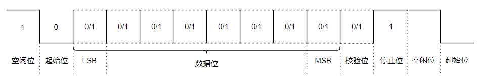

**起始位-数据位-校验位-停止位**

- 起始位:表示后续 bit 为数据
- 数据位:真实数据(5-8 位)
- 校验位:(可有可无)校验数据传输是否出错,不能纠错，在发现错误后，只能要求重发

  > **奇偶校验**
  >
  > - 奇校验：就是让原有数据序列中（包括你要加上的一位）1 的个数为奇
  > - 偶校验：就是让原有数据序列中（包括你要加上的一位）1 的个数为偶数
  >   假如采用 奇校验，发送端发送的一个字符编码（含校验位）中，“1”的个数一定为奇数个，在 接收端对接收字符二进制位中的“1”的个数 进行统计，若统计出“1”的个数为偶数个，则意味着传输过程中有 1 位（或奇数位）发生差错。

- 停止位:高电平,1,1.5,2 位

**接收方对于连续的 1 或者连续的 0 通过波特率和时间来计算有多少个 1 或 0**
但是,由于发送和接收双方的时钟不同步,每次发送的数据超过一个字节会造成误差,最终导致数据发送错位,这就要求 UART 发送数据时候,字节不能连续发送

> UART 协议规定
>
> 1. 数据线空闲时候,数据线保持高电平(高 1 低 0)
> 2. 数据的发送**先发低位,后发高位**

##### 硬件连接

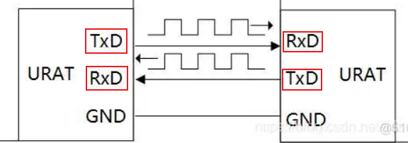

##### UART 控制器

https://juejin.cn/post/7152668856480170015

##### RS232 RS485

使用 UART 通信协议,由于硬件连接,百花齐放,为了统一,出了一个标准 RS232

后面由于 RS232 出现 抗干扰能力差,通信距离极短的问题又出现了 RS485 标准

#### IIC

##### 介绍

10k/s

IIC 总线是一种`串行`,`半双工`总线.主要用于近距离,低速芯片之间的通信;

IIC 总线有两根双向的信号线,一根数据线 SDA 用于收发数据,一个时钟线用于通信双方通信时钟的同步;

IIC 总线硬件结构简单,成本较低,广泛应用

##### IIC 总线

**硬件示例**

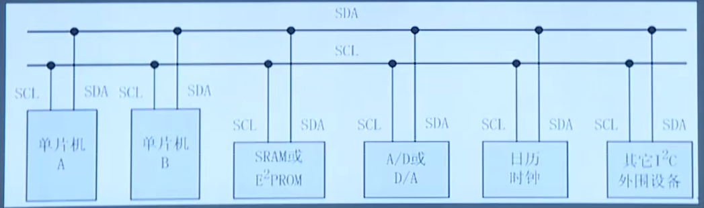

**特点**

- IIC 总线是一个多主机总线,连接在 IIC 总线上的器件分为**主机**和**从机**,**主机有权发起和结束一次通信,而从机只能被主机呼叫**;
- 当总线上有多个主机同时启用总线时，IIC 也具备**冲突检测和伸裁的功能**来防止错误产生
- 每个连接到 IIC 总线上的器件都有一个唯一的地址(7bit)，且每个器件都可以作为主机也可以作为从机(**同一时刻只能有一个主机**),总线上的器件增加和删除不影响其他器件正常工作;
- IIC 总线在通信时总线上发送数据的器件为**发送器**，接收数据的器件为**接收器**(发送器既可以是主机也可以是从机,接收器也是)

##### IIC 通信过程

1. 主机发送`起始信号`启用总线
2. 主机发送一个字节数据`指明从机地址`和后续字节的`传送方向`
3. 被寻址的`从机发送应答信号`回应主机
4. `发送器`发送一个字节数据
5. `接收器`发送应答信号回应发送器
6. (循环步骤 4、5)
7. 通信完成后`主机发送停止信号`释放总线

##### IIC 总线寻址方式

- IIC 总线上传送的数据是广义的，`既包括地址，又包括真正的数据`
- 主机在发送起始信号后必须先发送一个字节的数据，`该数据的高 7 位为从机地址，最低位表示后续字节的传送方向`,`0 表示主机发送数据，1 表示主机接收数据``
- 总线上所有的从机接收到该字节数据后都将这 7 位地址与自己的地址进行比较，如果相同，则认为自己被主机寻址，然后再`根据第 8 位将自己定为发送器或接收器`

##### IIC 起始信号 终止信号

- SCL 为高电平时，SDA 由高变低表示起始信号
- SCL 为高电平时，SDA 由低变高表示停止信号
- `主机发出起始信号和停止信号`
- 起始信号产生后总线处于`占用状态`;停止信号产生后总线处于`空闲状态`

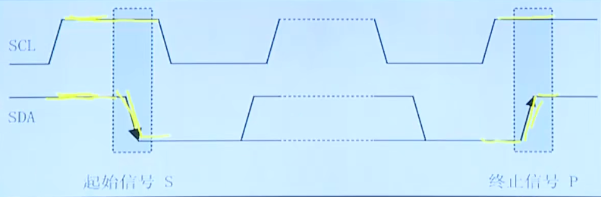

##### IIC 字节传送与应答

IIC 总线通信时每个字节为 8 位长度，**数据传送时，先传送最高位，后传送低位，**

**发送器发送完一个字节数据后接收器必须发送 1 位应答位来回应**

发送器即一帧共有 9 位

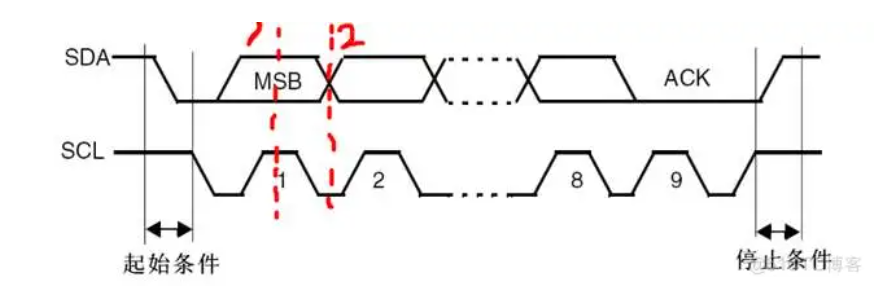

**IIC 协议要求在时钟信号 SCL 为高电位的期间，数据线 SDA 上的数据要保持稳定，不能发生变化（上图中 1 的位置）。只有在时钟信号 SCL 电位变低的时候，数据线 SDA 上的电平状态才能发生跳变。(SCL 拉低，准备数据，此时数据可以进行翻转，SCL 拉高，此时数据不可以进行翻转，此时发送数据)**

##### IIC 同步信号

所有的通信都需要解决两个问题:

1. 通信双方什么时候发,什么时候收
2. 接收方如何分辨连续信号问题(1100 \_-\_\_\_-)

UART:

1. 起始位终止位
2. 波特率掐时间

IIC:

1. 起始终止信号
2. SCL 告诉发送方什么时候发送数据(scl=0),告诉接收方什么时候接收数据的(scl=1)

**IIC 总线在进行数据传送时，
时钟线 SCL 为低电平期间发送器向数据线上发一位数据，在此期间数据线上的信号允许发生变化
时钟线 SCL 为高电平期送间,接收器从数据线上读取一位数据,在此期间数据线上的信号不允许发生变化，必须保持稳定**

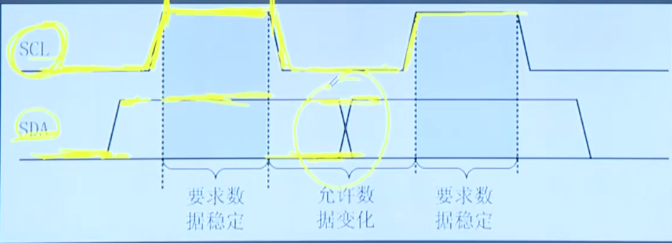

##### IIC 应用

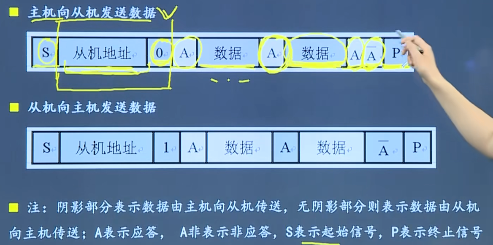
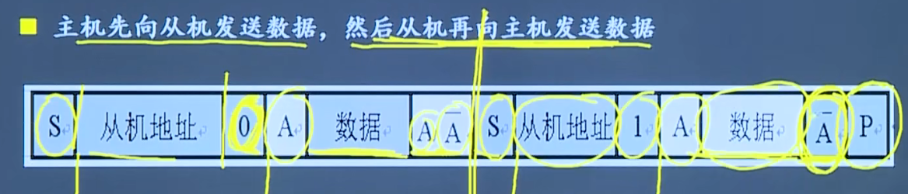

第三应用场景特殊在需要两次 IIC,第一次 IIC 主机不发送终止信号,保持对 SDA 的占有权限,继续让从机作为发送方,进行数据双向传递

IIC 空闲时候,SCL+SDA 高电平
https://blog.51cto.com/wangjunlv/5838840

#### SPI

##### 介绍

SPI 是串行外设接口的缩写,是一种高速的,全双工,同步的串行总线;

SPI 采用主从方式工作,一般有一个主设备和一个或多个;
SPI 需要至少 4 根线，分别是 MISO(主设备输入从设备输出) 、MOSI (主设备输出从设备输入)、SCLK(时钟)、CS (chip select 片选)SPI 使用引脚较少且布线方便，所以越来越多的芯片集成了这种通信协议;

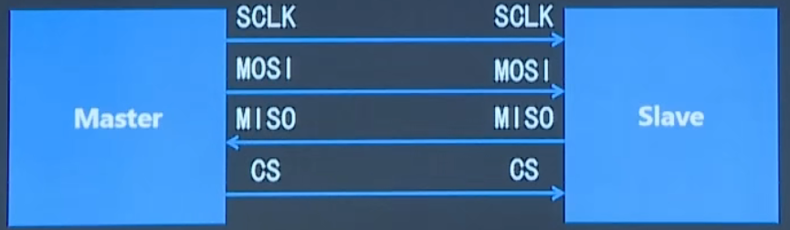

##### SPI 寻址方式

当主设备要和某个从设备进行通信时，主设备需要先向对应从设备的片选线上发送使能信号(高电平或者低电平根据从机而定) 表示选中该从设备

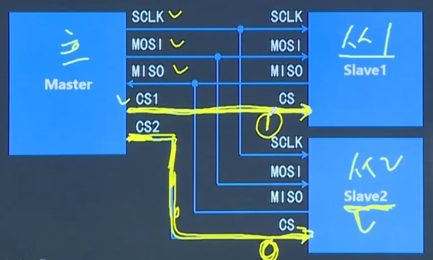

##### SPI 通信过程

- SPI 总线在进行数据传送时，**先传送高位，后传送低位**;
- 数据线为高电平表示逻辑“1’，低电平表示逻辑“0’;
- 一个字节传送完成后无需应答即可开始下一个字节的传送;

SPI 总线采用同步方式工作，**时钟线在上升沿或下降沿时发送器向数据线上发送数据，在紧接着的下降沿或上升沿时接收器从数据线上读取数据，完成一位数据传送**,八个时钟周期即可完成一个字节数据的传送;

##### SPI 极性和相位

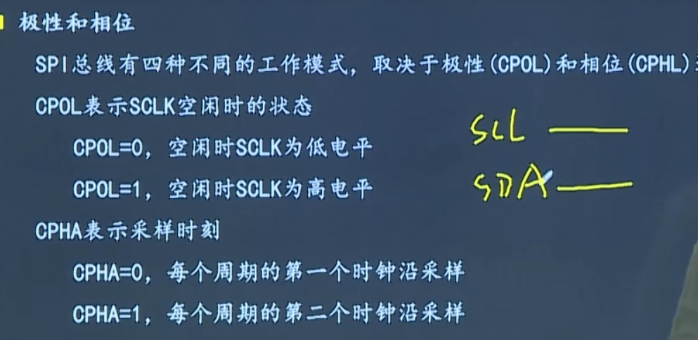

https://blog.51cto.com/wangjunlv/5834982
