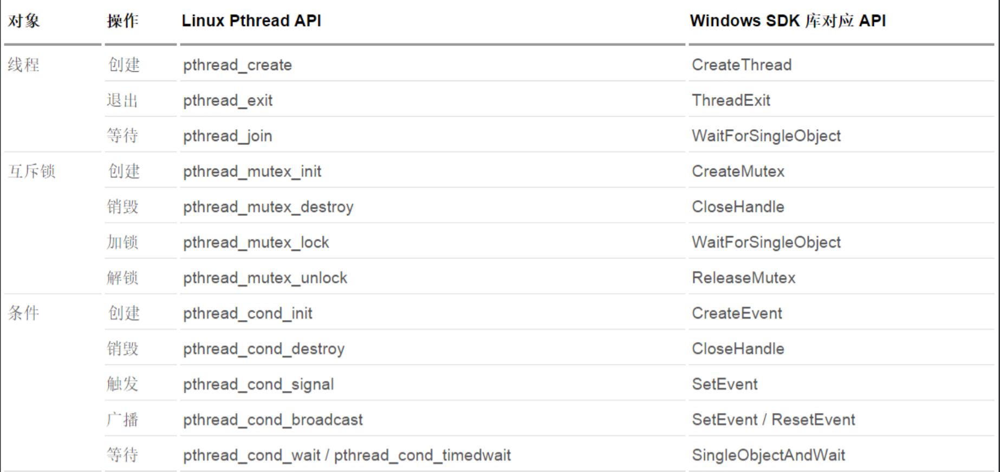

#### 线程

线程与进程区别：

1. 系统会为每个进程开辟地址空间并维护进程的堆栈，代码段，数据段，但多个线程会共享一个进程的
   开辟多个线程系统不会为其分配内存空间
2. 线程是相对节俭的多任务方式

线程相比进程优点：

1. **节俭，开销小的多任务方式**：线程切换，线程启动开销远小于进程切换启动，`线程没有独立的地址空间，进程中可以存在多个线程，多个线程共享进程地址空间`
2. **线程通信方便**：进程之间的通信复杂费时（有其存在的必要性），线程之间共享数据空间，所以线程的数据可以为另一个线程直接使用

#### Linux 线程 API

linux 平台的多线程开发，使用成熟的 `pthread 库`

多线程开发的最基本概念主要包含三点以及各自的操作：

3+4+5

1. 线程；创建，退出，等待
2. 互斥锁；创建，销毁，加锁，解锁
3. 条件；创建，销毁，触发，广播，等待



##### 1. 线程创建

```c
#include <pthread.h>

int pthread_create(pthread_t *restrict tidp, const pthread_attr_t *restrict attr, void *(*start_rtn)(void *), void *restrict arg);
```

**参数解释**

- tidp：指向的内存单元被设置为新创建线程的线程 ID，用于保存新线程的 tid（线程 ID）
- attr：用于定制各种不同的线程属性，暂可以把它设置为 NULL，以创建默认属性的线程
- start_rtn：线程运行函数的地址，即函数指针，指向`新线程应该加载执行的函数模块`
- arg：如果需要向 start_rtn 函数传递的参数不止一个，那么需要把这些参数放到一个结构中，然后把这个结构的地址作为 arg 参数传入(最后一个参数是运行函数的参数。)

##### 2. 线程退出

单个线程可以通过以下三种方式退出，在不终止整个进程的情况下停止它的控制流：

1. 线程只是从启动例程中返回，返回值是线程的退出码
2. 线程可以被同一进程中的其他线程取消
3. 线程调用 pthread_exit

```c
#include <pthread.h>
// 退出线程， 参数是个空类型的指针保存的是线程退出以后的返回值
int pthread_exit(void *rval_ptr);
```

**参数解释**

- rval_ptr：线程退出时传递出的参数，可以是退出值或地址。是地址时，不能是线程内部申请的局部地址。

> 注意：任何线程里 exit()函数导致进程退出，其他线程未结束工作，主线程退出时不能 return 或 exit()。
> 需要注意，pthread_exit 或者 return 返回的指针指向的内存单元必须是全局的或者是 malloc 分配的，不能在线程函数的栈上分配，因为当其它线程得到这个返回指针时线程函数已经退出了。

##### 3. 线程等待

```c
#include <pthread.h>
int pthread_join(pthread_t thread, void **rval_ptr);
// 返回：若成功返回0，否则返回错误编号
```

函数 pthread_join `用来等待一个线程的结束`。pthread_join()函数，**以阻塞的方式**等待 thread 指定的线程结束。

当函数返回时，被等待线程的资源被收回，如果线程已经结束，那么该函数会立即返回，并且指定的线程必须是 joinable 的。

可以通过调用 pthread_join 自动把线程置于分离状态，这样资源就可以恢复。
如果线程已经处于分离状态，pthread_join 调用就会失败，返回 EINVAL。

**参数解释**

- thread：被等待的线程标识符，回收线程 tid
- rval_ptr：用户定义的指针，用来存储被等待线程的返回值（接收退出线程传递出的返回值）。

> 注意：这个函数是一个线程阻塞的函数，调用它的函数将挂起等待直到被等待的（id 为 thread 的）线程结束为止，当函数返回时，被等待线程的资源被收回。thread 线程以不同的方式终止，通过 pthread_join 得到的终止状态是不同的，总结如下：

- 如果 thread 线程通过 return 返回，retval 所指向的单元里存放的是 thread 线程函数的返回值；
- 如果 thread 线程是被别的线程调用 pthread_cancel 异常终止掉，retval 所指向的单元里存放的是常数 PTHREAD_CANCELED；
- 如果 thread 线程是自己调用 pthread_exit 终止的，retval 所指向的单元存放的是传给 pthread_exit 的参数；
- 如果对 thread 线程的终止状态不感兴趣，可以传 NULL 给 retval 参数。

##### 4. 线程脱离

一个线程或者是可汇合（`joinable`，默认值），或者是脱离的（`detached`）

##### 5. 线程 ID 获取及比较

```c
#include <pthread.h>
pthread_t pthread_self(void);
// 返回：调用线程的ID
```

对于**线程 ID 比较**，为了可移植操作，我们不能简单地把线程 ID 当作整数来处理，因为不同系统对线程 ID 的定义可能不一样。我们应该要用下边的函数：

```c
#include <pthread.h>
int pthread_equal(pthread_t tid1, pthread_t tid2);
// 返回：若相等则返回非0值，否则返回0
```

对于多线程程序来说，我们往往需要对这些多线程进行同步。
<u>同步（synchronization）是指在一定的时间内只允许某一个线程访问某个资源。而在此时间内，不允许其它的线程访问该资源</u>。
我们可以通过互斥锁（mutex），条件变量（condition variable）和读写锁（reader-writer lock）来同步资源。

##### 6. 线程控制代码案例

```c
#include <pthread.h>
#include <stdio.h>
#include <sys/types.h>
#include <unistd.h>
// int pthread_create(pthread_t *thread, const pthread_attr_t *attr,
//                    void *(*start_routine)(void *), void *arg);

struct test {
  char *pstr;
  int num;
};

void *handler(void *args) {
  // 获取线程ID
  printf("thread:%lu thread is created\n", (unsigned long)pthread_self());
  // 打印参数
  printf("thread:get params is %d\n", ((struct test *)args)->num);
  printf("thread:get params is %s\n", ((struct test *)args)->pstr);
  // static 防止局部函数消失导致局部变量的消失
  static struct test returnMessage = {"test message", 22};
  // 将线程执行结果传参返回主线程
  pthread_exit((void *)&returnMessage);
}
int main(int argc, char **argv) {
  printf("main:process pid %d\n", getpid());

  pthread_t threadId;
  // 线程任务的参数
  struct test tt2;
  tt2.num = 404;
  tt2.pstr = "Not Found";
  // 1.
  // 创建新的线程，id，线程属性（NULL表示默认属性），线程任务/函数，线程函数参数
  int ret = pthread_create(&threadId, NULL, handler, (void *)&tt2);

  if (ret == 0) {
    printf("main:create %ld thread successfully\n", threadId);
  } else {
    printf("main:create thread unsuccessfully\n");
  }

  // 存储线程返回信息
  struct test *tt1;
  // 2. 等待线程threadId结束，并将该线程返回结果储存在tt1中
  int joinRet = pthread_join(threadId, (void **)&tt1);
  // 返回0表示等着了
  if (joinRet == 0) {
    printf("main:wait finish\n");
    printf("main:thread return code %d\n", tt1->num);
    printf("main:thread return message %s\n", tt1->pstr);
  } else {
    printf("main:error occurs,return code is %d\n", joinRet);
  }
  return 0;
}
```

##### 7. 线程共享数据段代码案例

```c
// 全局变量g_data
#include <pthread.h>
#include <stdio.h>
#include <sys/types.h>
#include <unistd.h>
// int pthread_create(pthread_t *thread, const pthread_attr_t *attr,
//                    void *(*start_routine)(void *), void *arg);

int g_data = 0;

void *handler1(void *args) {
  while (1) {
    printf("thread1 g_data:%d\n", g_data++);
    sleep(1);
  }
}
void *handler2(void *args) {
  while (1) {
    printf("thread2 g_data:%d\n", g_data++);
    sleep(1);
  }
}
int main(int argc, char **argv) {

  pthread_t threadId1;
  pthread_t threadId2;

  // 1.
  // 创建新的线程，id，线程属性（NULL表示默认属性），线程任务/函数，线程函数参数
  int ret1 = pthread_create(&threadId1, NULL, handler1, NULL);
  int ret2 = pthread_create(&threadId2, NULL, handler2, NULL);

  while (1) {
    printf("main g_data:%d\n", g_data++);
    sleep(1);
  }
  return 0;
}
```

#### Linux 互斥锁 API

> 锁的存在是为了让本线程操作临界资源(共享资源)的时候不被打扰；
> 当一个线程释放锁后，剩余线程获取锁是竞争状态

互斥量（mutex）从本质上来说是一把锁，在访问**共享资源**前对互斥量进行加锁，在访问完成后释放互斥量上的锁。

对互斥量进行加锁后，**任何其他试图再次对互斥量加锁的线程将会被阻塞直到当前线程释放该互斥锁**。

如果释放互斥锁时有多个线程阻塞，所有在该互斥锁上的阻塞线程都会变成可运行状态，第一个变为可运行状态的线程可以对互斥量加锁，其他线程将会看到互斥锁依然被锁住，只能回去等待它重新变为可用。

在这种方式下，每次只有一个线程可以向前运行。

使用互斥锁（互斥）可以**使线程按顺序执**行。通常，`互斥锁通过确保一次只有一个线程执行代码的临界段来同步多个线程`。互斥锁还可以保护单线程代码。

在设计时需要规定所有的线程必须遵守相同的**数据访问规则**。只有这样，互斥机制才能正常工作。操作系统并不会做数据访问的串行化。如果允许其中的某个线程在没有得到锁的情况下也可以访问共享资源，那么即使其它的线程在使用共享资源前都获取了锁，也还是会出现数据不一致的问题。

##### 1. 创建及销毁互斥锁

```c
#include <pthread.h>
// 初始化互斥锁
int pthread_mutex_init(pthread_mutex_t *restrict mutex, const pthread_mutexattr_t *restrict attr);
// 销毁一个互斥锁
// 释放线程占用的资源，且要求锁当前处于开放状态。
// 由于在Linux中，互斥锁并不占用任何资源，因此LinuxThreads中的 pthread_mutex_destroy()除了检查锁状态以外（锁定状态则返回EBUSY）没有其他动作。
int pthread_mutex_destroy(pthread_mutex_t* mutex);
// 返回：若成功返回0，否则返回错误编号
```

初始化互斥锁两种方式：

1. 静态方式：mutex = PTHREAD_MUTEX_INITIALIZER
2. 动态方式：pthread_mutex_init(&mutex,NULL)

**参数解释**

1. mutex：类型为 pthread_mutex_t 的变量，存储互斥锁信息
2. attr：指定互斥锁属性

attr 取值：

- PTHREAD_MUTEX_TIMED_NP/NULL：缺省值，当一个线程加锁以后，其余请求锁的线程将形成一个等待队列，并在解锁后按优先级获得锁。这种锁策略保证了资源分配的公平性。
- PTHREAD_MUTEX_RECURSIVE_NP：嵌套锁，允许同一个线程对同一个锁成功获得多次，并通过多次 unlock 解锁。如果是不同线程请求，则在加锁线程解锁时重新竞争
- PTHREAD_MUTEX_ERRORCHECK_NP：检错锁，如果同一个线程请求同一个锁，则返回 EDEADLK，否则与 PTHREAD_MUTEX_TIMED_NP 类型动作相同。这样就保证当不允许多次加锁时不会出现最简单情况下的死锁。
- PTHREAD_MUTEX_ADAPTIVE_NP：适应锁，动作最简单的锁类型，仅等待解锁后重新竞争。

##### 2. 加锁及解锁

```c
#include <pthread.h>
// 加锁，获取不到锁会挂起
int pthread_mutex_lock(pthread_mutex_t* mutex);
// 解锁
int pthread_mutex_trylock(pthread_mutex_t* mutex);
// 在锁已经被占据时返回EBUSY而不是挂起等待
int pthread_mutex_unlock(pthread_mutex_t* mutex);
// 返回：若成功返回0，否则返回错误编号
```

#### 死锁

死锁，至少有两个线程，A 线程拥有 a 资源，要请求 b 资源，B 线程拥有 b 资源，要请求 a 资源

A 线程请求 b 资源时候，持有的 a 资源不会释放，所以 B 线程进入等待

同样，线程 B 请求 a 资源时，持有 b 资源不会释放，线程 A 等待

双方都进入等待状态

解决办法，线程对资源持有时间设置定时，超时则释放资源

或者单个线程需要的资源一次性全部请求完成、

每个线程加锁顺序一致

##### 代码案例

```c
#include <pthread.h>
#include <stdio.h>
#include <stdlib.h>
#include <sys/types.h>
#include <unistd.h>

pthread_mutex_t mutex;

void* handler1(void* args) {
  pthread_mutex_lock(&mutex);
  printf("thread1:thread1's id is %ld\n", pthread_self());
  pthread_mutex_unlock(&mutex);
}
void* handler2(void* args) {
  pthread_mutex_lock(&mutex);
  printf("thread2:thread2's id is %ld\n", pthread_self());
  pthread_mutex_unlock(&mutex);
}

int main(int argc, char** argv) {
  printf("main:main process's pid is %d\n", getpid());
  pthread_t tId1;
  pthread_t tId2;

  // 创建/初始化互斥锁
  // 1. 动态初始化
  int initMutex = pthread_mutex_init(&mutex, NULL);
  if (initMutex != 0) {
    printf("mutex init unsuccessfully\n");
    exit(-1);
  }
  // 2. 静态初始化
  //   mutex = PTHREAD_MUTEX_INITIALIZER;

  //  int pthread_create(pthread_t *thread, const pthread_attr_t *attr,
  //                           void *(*start_routine) (void *), void *arg);
  int ret1 = pthread_create(&tId1, NULL, handler1,
                            (void*)"this is messsage1 from main");
  int ret2 = pthread_create(&tId2, NULL, handler2,
                            (void*)"this is messsage2 from main");

  if (ret1 == 0 && ret2 == 0) {
    printf("main:create pthread successfully\n");
  } else {
    printf("main:create pthread unsuccessfully\n");
  }

  while (1)
    ;
  // 干掉互斥量

  pthread_mutex_destroy(&mutex);
  return 0;
}
```

#### Linux 条件变量 API

`条件变量`是线程另一可用的同步机制。

条件变量给多个线程提供了一个会合的场所。条件变量与互斥量一起使用时，允许线程以无竞争的方式等待特定的条件发生

条件本身是由互斥量保护的。<u>线程在改变条件状态前必须首先锁住互斥量，其他线程在获得互斥量之前不会察觉到这种改变，因为必须锁定互斥量以后才能计算条件。</u>

条件变量使用之前必须首先初始化，pthread_cond_t 数据类型代表的<u>条件变量可以用两种方式进行初始化，可以把常量 PTHREAD_COND_INITIALIZER 赋给静态分配的条件变量，但是如果条件变量是动态分配的，可以使用 pthread_cond_destroy 函数对条件变量进行去除初始化（deinitialize）</u>。

##### 1. 创建及销毁条件变量

```c
#include <pthread.h>
int pthread_cond_init(pthread_cond_t *restrict cond, const pthread_condattr_t *restrict attr);
int pthread_cond_destroy(pthread_cond_t cond);
// 返回：若成功返回0，否则返回错误编号
```

条件变量采用的数据类型是 pthread_cond_t, 在使用之前必须要进行初始化, 这包括两种方式:

1. 静态: 可以把常量 PTHREAD_COND_INITIALIZER 给静态分配的条件变量.
2. 动态: pthread_cond_init 函数, 是释放动态条件变量的内存空间之前, 要用 pthread_cond_destroy 对其进行清理.

##### 2. 等待

```c
#include <pthread.h>
int pthread_cond_wait(pthread_cond_t *restrict cond, pthread_mutex_t *restrict mutex);
int pthread_cond_timedwait(pthread_cond_t *restrict cond, pthread_mutex_t *restrict mutex, cond struct timespec *restrict timeout);
// 返回：若成功返回0，否则返回错误编号
```

pthread_cond_wait 等待条件变为真。

如果在给定的时间内条件不能满足，那么会生成一个代表一个出错码的返回变量。

传递给 pthread_cond_wait 的互斥量对条件进行保护，调用者把锁住的互斥量传给函数。

pthread_cond_wait 得到互斥量 mutex 会对其进行解锁，让别的线程可以获得锁，然后如果没被唤醒，线程就会挂起（不占用任何 CPU 周期）


函数把调用线程放到等待条件的线程列表上，然后对互斥量解锁，这两个操作都是原子操作。这样就关闭了条件检查和线程进入休眠状态等待条件改变这两个操作之间的时间通道，这样线程就不会错过条件的任何变化。pthread_cond_wait 返回时，互斥量再次被锁住。

pthread_cond_timedwait 函数的工作方式与 pthread_cond_wait 函数类似，只是多了一个 timeout。timeout 指定了等待的时间，它是通过 timespec 结构指定。

##### 3. 触发

```c
#include <pthread.h>
int pthread_cond_signal(pthread_cond_t cond);
int pthread_cond_broadcast(pthread_cond_t cond);
// 返回：若成功返回 0，否则返回错误编号
```

这两个函数可以用于**通知线程条件已经满足**。

pthread_cond_signal 函数将唤醒等待该条件的某个线程，而 pthread_cond_broadcast 函数将唤醒等待该条件的所有进程。

注意一定要在改变条件状态以后再给线程发信号

##### 4. 代码案例

```c
#include <pthread.h>
#include <stdio.h>
#include <sys/types.h>
#include <unistd.h>

pthread_mutex_t mutex;
pthread_cond_t cond;

int g_data = 0;

void* handler1(void* args) {
  printf("thread1: thread1's id is %ld\n", pthread_self());
  //   printf("thread1: thread1 get params is %s\n", (const char*)args);
  while (1) {
    pthread_cond_wait(&cond, &mutex);
    printf("thread1 get g_data = %d\n", g_data);
    // printf("thread1 quit\n");
    g_data = 0;
    // pthread_exit(NULL);
    sleep(1);
  }
}
void* handler2(void* args) {
  printf("thread2: thread2's id is %ld\n", pthread_self());
  //   printf("thread2: thread2 get params is %s\n", (const char*)args);

  while (1) {
    pthread_mutex_lock(&mutex);
    printf("thread2 g_data is %d\n", g_data);
    g_data++;
    pthread_mutex_unlock(&mutex);
    if (g_data == 3) {
      pthread_cond_signal(&cond);
    }
    sleep(1);
  }
}

int main() {
  printf("main: main's id is %d\n", getpid());

  pthread_t tid1;
  pthread_t tid2;

  pthread_mutex_init(&mutex, NULL);
  pthread_cond_init(&cond, NULL);
  int ret1 = pthread_create(&tid1, NULL, handler1,
                            (void*)"this is message1 from main");

  if (ret1 != 0) {
    printf("create thread1 unsuccessfully\n");
  }
  int ret2 = pthread_create(&tid2, NULL, handler2,
                            (void*)"this is message2 from main");
  if (ret2 != 0) {
    printf("create thread2 unsuccessfully\n");
  }

  pthread_join(tid1, NULL);
  pthread_mutex_destroy(&mutex);
  pthread_cond_destroy(&cond);
  return 0;
}
```
