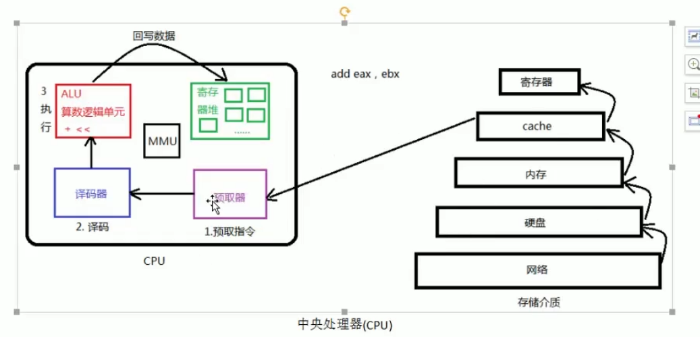

1.  进程相关的概念

    - 进程和程序

      `程序`是指编译好的二进制文件，存储在磁盘上面，不占用系统资源

      `进程`是活跃的程序，占用系统资源

      > 同一个程序可以加载为不同的进程（彼此之间互相不影响）

    - 并发

    - 单道程序设计

      cpu 一次运行一个进程，其他进程排队等待正在运行的进程运行结束后才有机会上 cpu

    - 多道程序设计

      宏观上，cpu 给多个进程分配时间片，进程只有在规定的时间片内才能执行，不论执行是否结束，时间片结束就会下 cpu，多个进程处于竞争状态

    - cpu/mmu

    

    

    - 进程控制块
    
    - 进程状态

2.  环境变量

    常用的环境变量/作用

    函数

3.  进程控制原语

    fork 函数

        循环创建子进程的架构

    exec 函数族

        各个函数的参数使用方法/作用

    wait/waitpid

        回收子进程的一般方式
