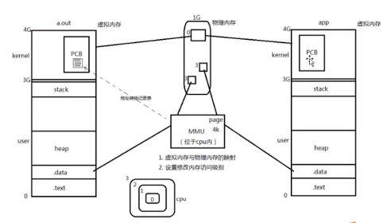

1.  进程相关的概念

    - 进程和程序

      `程序`是指编译好的二进制文件，存储在磁盘上面，不占用系统资源

      `进程`是活跃的程序，占用系统资源

      > 同一个程序可以加载为不同的进程（彼此之间互相不影响）

    - 并发

    - 单道程序设计

      cpu 一次运行一个进程，其他进程排队等待正在运行的进程运行结束后才有机会上 cpu

    - 多道程序设计

      宏观上，cpu 给多个进程分配时间片，进程只有在规定的时间片内才能执行，不论执行是否结束，时间片结束就会下 cpu，多个进程处于竞争状态

    - cpu/mmu

      

      

      MMU 主要负责两件事情：虚拟内存与物理内存的映射；设置修改内存的访问权限

      **虚拟地址**：可用的地址空间有 4G

      多个进程的内核区域（PCB，进程描述符），映射到物理内存的同一块区域（共用一块内核空间），一个内核空间的多个 pcb 彼此独立，互不影响

    - 进程控制块

      linux 内核的进程控制块是`task_struct结构体`

      
    - 进程状态

2.  环境变量

    常用的环境变量/作用

    函数

3.  进程控制原语

    fork 函数

        循环创建子进程的架构

    exec 函数族

        各个函数的参数使用方法/作用

    wait/waitpid

        回收子进程的一般方式
