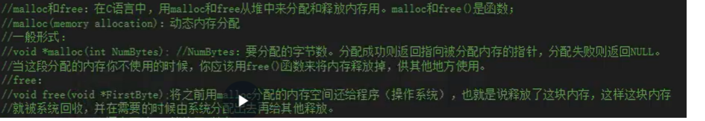
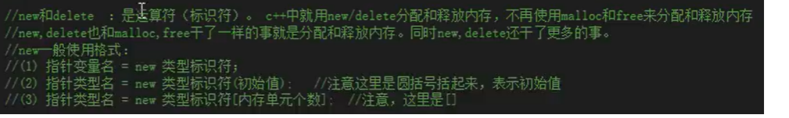

#### 一、命名空间

同名实体：同名函数，同名变量，同名类定义

命名空间是一种为了解决同名实体解析错误的机制，里面可以包含变量、函数、类、typedef、#define 等。程序可以定义多个命名空间，每个命名空间的名字独一无二，不可以重名。

> 命名空间可以看作作用域，不同命名空间的同名实体互不影响

##### 命名空间定义

语法格式

```c++
namespace name
{
    // variables,functions,classes
}
```

往命名空间定义可以不连续，可以在不同地方，不同文件进行定义

`对于命名空间，如果name不存在，则创建name命名空间；如果存在，则打开，并追加新的成员到命名空间`

##### 命名空间使用

语法格式

```c++
namespace Name
{
    int a;
    void radius();
}
// 方式一
Name::a;
Name::radius();

// 方式二
using Name::a;
printf("%d\n",a);
```

- `::`域名解析符，用来指定特定命名空间的某个实体
- `using`关键字，表示 using 声明以后的程序中，变量 a 都具体解析到 Name 命名空间的 a，如果有重名变量，则需要使用::指定命名空间

> using 不仅可以用于变量，还可以用于整个命名空间。
> `using namespace Name`
> using 声明以后的程序中如果出现了未指明命名空间的实体，就使用 Name 下的；

**【注意】** 如果 Using 多个命名空间，命名空间存在同名实体，则调用时，需要指定具体命名空间

#### 二、基本的输入输出 cin,cout

语法格式

```c++

std::cout<<""<<std::endl;
```

`endl` 作用

- 输出换行符\n
- 强制刷新输出缓存区，缓冲区中所有数据都被系统清除

#### 三、局部变量及初始化

```c
// 局部变量
for (int i=0;i<10;i++)
{
    cout << "hello world" << endl;
}

// 变量定义+初始化
int a = 10;
int b {11};
int c = {11};// =可有可无
// 数组定义
int arr[]{0,1,2,3,4,5};
```

`直接赋值与使用大括号赋值相比：前者有隐式类型转换，后者则没有`

#### 四、auto

auto 变量的自动类型推断

`auto 可以声明变量的时候，根据变量的初始值的类型自动为此变量选择匹配的类型；（声明时要赋予初值）`

**auto 自动类型推断发生在编译期间，不会造成程序执行效率降低**

#### 五、头文件防卫式声明

```c++
#ifndef _projectname_filename_
#define _projectname_filename_

//xx
#endif
```

头文件防卫式声明可以有效解决头文件被多次包含，重复问题

#### 六、引用

语法格式

```c++
type &name = value
```

引用理解成为变量起了另一个名字，用&表示，别名和变量本身可以看成同一个变量，`&`只是起标识作用

```c++
int value = 10;
int &refval = value;
```

定义引用，并不额外占用内存，或者理解成，编译器使得引用表现得是和原变量占用同一块内存（实际不是）

**【注意】**

- 定义引用的时候必须初始化
- 引用必须绑定到变量上去，绑定到对象也可以。不能绑定到常量上去
- 定义的引用变量必须和等号右边变量类型相同
- 引用符号&在等号左边，与指针有区别

```cpp
// error
int &refval;
int &refval = 10;
int &refval = 10.23;
```

**【常用案例】**

```c++
// 函数形参为引用类型，可以使的函数内部对形参的修改返回到调用函数上面
void func(int &a,int &b){
    a=10;
    b=20;
}

int main(){
    int a=0;
    int b=0;
    func(a,b);
}
```

#### 七、常量

语法格式

```c++
const type variablename;
```

const 承诺不修改变量

#### 八、auto

auto 的原理就是`根据后面的值，来自己推测前面的类型是什么`

**作用**就是为了简化变量初始化，如果这个变量有一个很长很长的初始化类型，就可以用 auto 代替。

【注意点】

- 使用 auto 声明的变量必须初始化
- 函数和模板参数不能被声明为 auto
- auto 是一个占位符，并不是一个他自己的类型，不能用于类型转换或其他一些操作，如 sizeof 和 typeid
- 定义在一个 auto 序列的变量必须始终推导成同一类型

```c++
auto x1 = 5, x2 = 5.0, x3='r';  // This is too much....we cannot combine like this
```

#### 九、范围 for 语句

**作用**遍历一个循环

```cpp
int arr[]{1,2,3,4,5,6};
for(auto x:arr){// 数组arr中每一个元素，依次放入x中并打印x值，把arr中每个元素拷贝到X中，打印x值
for(auto &x:arr){// 省了拷贝的动作，提高系统效率
    cout<<x<<endl;
}
for(auto x:{1,2,3,4,5,6}){
    cout<<x<<endl;
}
```

#### 十、动态分配内存问题





