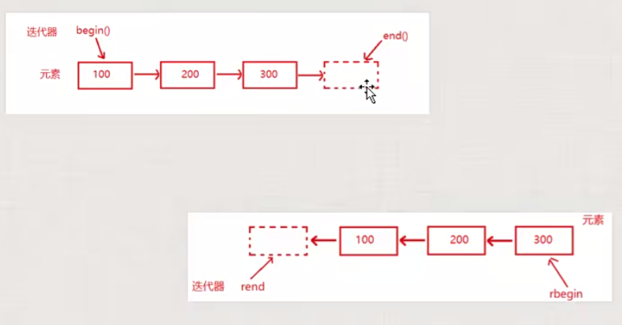

#### 1. 迭代器简介

迭代器是一种遍历容器内元素的 数据类型，**有点类似指针**，理解为迭代器用来指向容器中的某个元素

_对 string，vector 类型的容器很少使用[]访问容器元素，更加通用的方式是使用迭代器_

通过迭代器可以`读写容器中元素值`

> 后面尽量使用迭代器来访问容器元素值

> 有容器的地方就需要有一个迭代器

#### 2. 容器的迭代器类型

每一种容器都有对应的容器类型。

**容器类型变量定义语法**

```c++

vector<int> arr{0,1,2,3,4};
vector<int>::iterator pos;
```

可以把`vector<int>::iterator`理解成一类型，专门用于声明迭代器类型。

#### 3. 迭代器 begin/end 操作，反向迭代器 rbegin/rend

begin()/end()，rbegin()/rend()返回一个迭代器类型

- begin，如果容器不为空，其 _返回一个指向容器第一个元素的迭代器_
- end，_返回一个指向容器最后一个元素后面的迭代器，其指向一个不存在容器内的元素_
- _如果一个容器为空，那么 begin 和 end 返回的迭代器就相同_
- rbegin/rend，称为逆向迭代器，



```c++
vector<int> arr{0,1,2,3,4};
vector<int>::iterator pos;
pos = arr.begin();
pos = arr.end()

vector<int> arr;
vector<int>::iterator pos1;
vector<int>::iterator pos2;
pos1 = arr.begin();
pos2 = arr.end()

if(pos1==pos2){
    cout << "hello world" << endl;
}

// vector容器遍历
vector<int> arr = {0,1,2,3,4,5,6};
// 正向迭代
for (vector<int>::iterator pos = arr.begin(); pos != arr.end();pos++) {
    cout << *pos << endl;
}
// 反向迭代
for (vector<int>::reverse_iterator pos = arr.rbegin(); pos != arr.rend(); pos++) {
    cout << *pos << endl;
}
```

#### 4. 迭代器运算符

- **\*pos**：返回迭代器 pos 所指向元素的引用。必须保证该迭代器指向的是有效元素。不能指向 end（），因为其是最后一个元素后面的位置，表示不存在的元素
- **pos++//++pos**：迭代器后移一个元素；已经指向 end()则不可再后移
- **pos--//--pos**：迭代器前移一个元素；已经指向 begin()则不可再前移
- **pos1==pos2//pos1!=pos2**：判断迭代器是否相等，如果指向同一个容器元素，则相等否则不等
-

```c++
struct student {
	int num;
};

// 如何引用结构体元素
vector<student> arr;
student stu;
stu.num = 01;
arr.push_back(stu);

vector<student>::iterator pos = arr.begin();

cout << pos->num << endl;
cout << (*pos).num << endl;
```

#### 5. const_iterator 迭代器

const_iterator 表示值不能改变的意思。

不能改变迭代器指向的元素值，但是迭代器本身的指向可以发生改变。

只能从容器中读元素，不能通过这个迭代器改写容器中的元素。类似常量指针。

iterator 可读可写

```c++

vector<int> arr = { 0,1,2,3,4,5,6 };

vector<int>::const_iterator pos = arr.begin();

for (vector<int>::const_iterator pos = arr.begin(); pos != arr.end(); pos++) {
    cout << *pos << endl;
}

for (vector<int>::const_reverse_iterator pos = arr.rbegin(); pos != arr.rend(); pos++) {
    // *pos = 10; // error
    cout << *pos << endl;
}
```

**cbegin/cend 返回常量迭代器**

```c++
vector<int> arr = { 0,1,2,3,4,5,6 };

for (auto pos = arr.cbegin(); pos != arr.cend(); pos++) {
    // *pos = 10; // error
    cout << *pos << endl;
}

for (vector<int>::const_iterator pos = arr.cbegin(); pos != arr.cend(); pos++) {
    // *pos = 10; // error
    cout << *pos << endl;
}
```

#### 6. 迭代器失效

`操作迭代器遍历容器的过程中，尽量不要改变容器的容量（增加或删除），否则会产生异变，从而引起程序崩溃`

`但是，使用迭代器遍历容器的时候，需要修改容器容量，可以在修改操作后break出去，不再遍历，这样也是可以的`

```c++
// 失效的范围for语句
// 范围for内部由迭代器实现
vector<int> arr{0,1,2,3,4,5,6};

for(auto item:arr){
    // 遍历的过程中修改容器数量
    arr.push_back(888);
    cout<<item<<endl;
}

for (vector<int>::iterator begin = arr.begin(), end = arr.end(); begin != end; ++begin) {
    arr.push_back(88);
    cout << *begin << endl;
}


// 保证插入不失效

vector<int> arr{0,1,2,3,4,5,6};
auto begin = arr.begin();
int count = 0;
while(begin!=arr.end()){
    begin = arr.insert(begin,0);
    count++;
    if(count>=10){
        break;
    }
    ++begin;
}

// 清空容器-正确做法
while(!arr.empty()){
    auto pos = arr.begin();
    arr.erase(pos);
}

// 清空容器-错误做法
for(auto begin=arr.begin(),end = arr.end();begin!=end;++begin){
    arr.erase(begin);
}
```

#### 7. 经典范例演示

```c++
// string迭代
string str = "you love me?";
for (auto begin = str.begin(); begin != str.end(); begin++) {
    *begin=toupper(*begin);
}
cout << str << endl;

// 迭代器释放内存
for (auto begin = str.begin(); begin != str.end(); begin++) {
    delete (*begin);
}

arr.clear();

```
