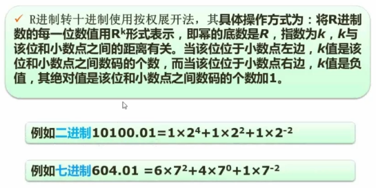
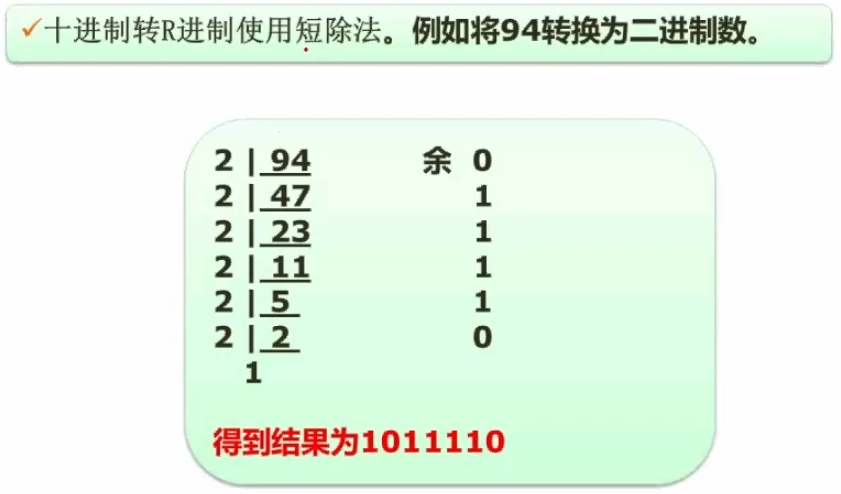
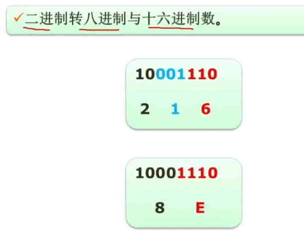
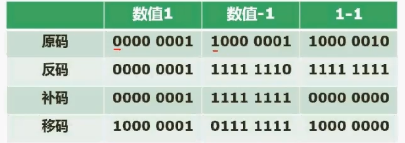
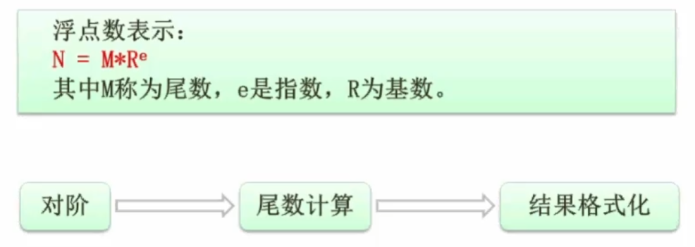

**R 进制转十进制**

**十进制转 R 进制**

**二进制转 八，十六 进制（翻过来同样适用）**

**原码，反码，补码，移码**

【解释】

- **原码**：数字的二进制形式（最左边为`符号位`，`整数为0，负数为1`）
- **反码**：正数的反码为其原码，负数的反码是 符号位不动，其他位元素取反
- **补码**：正数的补码为其原码，负数的补码是 其反码+1
- **移码**：正数的移码为其补码符号位取反，其余不动；负数的移码是其补码的符号位取反其余不动

**数值表示范围【常考】**
||整数|
|---|---|
|原码|-2^(n-1)-1 —— 2^(n-1)-1 |
|反码|-2^(n-1)-1 —— 2^(n-1)-1|
|补码|-2^(n-1) —— 2^(n-1)-1|

> n 为 比特位数量 1Byte 就是八位，1 字节可以存储的数据范围就是-127 —— 127

> 最大值都是一样的，最小值只有补码比其余的两个多 1

**浮点数运算（科学计数法）**

第一步 对阶

如果两个浮点数的指数 e 不同，`一般都是小的往大的变`

第三步 结果格式化

尾数 M 一般要在[1,10)之间
