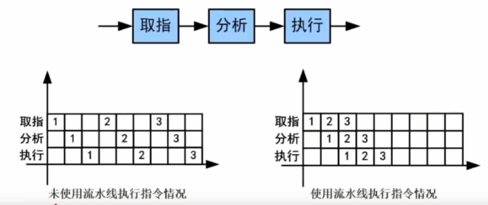
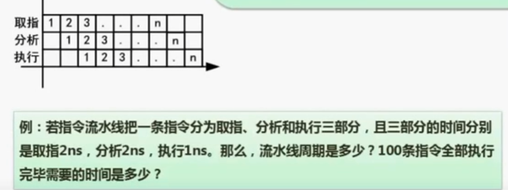
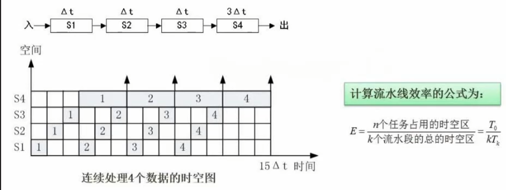

【必考】

#### 概念

流水线是指在程序执行时多条指令重叠进行操作的一种准并行处理实现技术。

`各部件同时处理`是`针对不同指令`而言的，可同时为多条指令的不同部分进行工作，以提高各部件的利用率和指令的平均执行速度。

如果未使用流水线技术，那么指令 1 的执行会存在 取值，分析部件的**偷闲**，使用流水线技术即可解决这种问题。

（流水线：指令的执行分多个步骤，流水线只有在多个指令需要执行的时候才有意义，多条指令需要运行时，本指令执行的单个步骤与其他步骤不存在关系，所以不用等待本指令的其他步骤完成再执行下一条指令的同一个步骤）

#### 流水线周期和执行时间计算

【例题】

**流水线周期** 为`执行时间最长的一段流水段`

**流水线执行时间** 计算公式为：

`1条指令执行时间+（指令条数-1）*流水线周期`

1. 理论公式：`(t1+t2+...+tk)+(n-1)*Δt`
2. 实际公式：`(k+n-1)*Δt`

> k 为段数（完成指令的步骤数），这里为 3
> Δt 为流水线周期

【解答】

上题流水线周期是 2ns，100 条指令执行的时间为（2+2+1）+（100-1）\*2=203ns，实际为 204ns，看题目要求，求解具体时间

#### 流水线吞吐率计算

**流水线的吞吐率**是指`在单位时间内流水线所完成的任务数量或输出的结果数量`。计算流水线吞吐率的最基本的公式如下：

`TP = 指令总数/流水线执行时间`

流水线最大吞吐率

`TPmax = 1/Δt`

【解答】

上题条件，流水线吞吐率为 100/203=0.49，最大吞吐率为 0.5

#### 流水线加速比计算

`完成同一批任务，不使用流水线所用的时间与使用流水线所用的时间之比`称为`流水线的加速比`

计算流水线加速比的基本公式如下：

`s = 不使用流水线执行时间/使用流水线执行时间`

> 加速比越大越说明流水线的高效

【解答】

上题条件，流水线的加速比为( 2 + 2 + 1 ) \* 100 / 203 = 2.46

#### 流水线效率计算

流水线的效率是指流水线的设备利用率。

在时空图上，流水线的效率定义为 n 个任务占用的时空区与 K 个流水段总的时空区之比

T0 = (Δt+Δt+Δt+3Δt)\*4
Tk = (15Δt\*4)
